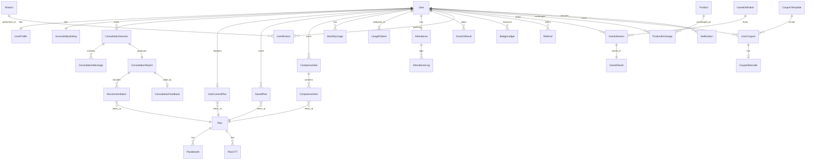

# AI 통신 요금제 상담 챗봇 — 데이터 모델링 문서

| 항목      | 내용                         |
| --------- | ---------------------------- |
| 문서명    | 데이터 모델링 명세서         |
| 버전      | v1.0                         |
| 기준 문서 | 기능명세서 v2.0              |
| 대상 DBMS | PostgreSQL 15+ (Supabase)    |
| 인증      | Supabase Auth (카카오 OAuth) |
| 작성일    | 2026-08-14                   |

> **참고**: 글로벌 룰에 MySQL/JPA 가이드가 등록되어 있으나, 본 프로젝트는 Supabase(PostgreSQL)를 실제 스택으로 사용 중이므로 프로젝트 컨벤션을 우선하여 PostgreSQL 물리 설계를 적용한다.

---

## 0. 설계 원칙

1. **정규화**: 제3정규형(3NF)을 기본으로 하되, 성능·조인 비용이 명백한 경우에만 제한적 반정규화(배열 컬럼 등)를 허용한다.
2. **식별자**: 모든 테이블은 `bigint` 자동증가 또는 `uuid` PK를 사용한다. 외부 노출 가능성이 있는 엔티티(쿠폰, 상품 교환 등)는 `uuid`를 사용한다.
3. **감사 컬럼**: 모든 비즈니스 테이블은 `created_at`, `updated_at` 타임스탬프를 가진다.
4. **소프트 삭제**: 개인정보가 포함된 테이블(사용자, 상담 레포트)은 `deleted_at` 컬럼으로 소프트 삭제를 지원한다.
5. **RLS(Row Level Security)**: 모든 사용자 데이터 테이블에 RLS를 적용하여 `auth.uid()` 기반으로 행 단위 접근을 통제한다.
6. **과설계 회피**: P2 기능(친구 추천, 랭킹, QR 코드 등)은 스키마에 포함하되 최소한의 컬럼으로 설계한다.

---

## 1. 개념적 설계 (Conceptual Design)

### 1.1 도메인 분할

기능명세서의 9개 서비스 영역을 바운디드 컨텍스트로 분할한다.

| 도메인             | 핵심 엔티티                                                                                        | 관련 기능 ID                  |
| ------------------ | -------------------------------------------------------------------------------------------------- | ----------------------------- |
| 인증·사용자        | User, UserProfile, AccessibilitySetting                                                            | F-01 ~ F-06                   |
| 요금제 카탈로그    | Plan, PlanBenefit, PlanOTT                                                                         | F-16, F-17, F-19              |
| AI 상담            | ConsultationSession, ConsultationMessage, ConsultationReport, Recommendation, ConsultationFeedback | F-07 ~ F-15                   |
| 사용자 요금제 관리 | UserCurrentPlan, SavedPlan, ComparisonSet, ComparisonItem                                          | F-18, F-20, F-21, F-53 ~ F-55 |
| 사용량 분석        | MonthlyUsage, UsagePattern                                                                         | F-23 ~ F-26                   |
| 리워드             | Attendance, AttendanceLog, ScratchResult, Mission, UserMission, BadgeLedger, Referral              | F-27 ~ F-33                   |
| 게임               | GameDefinition, GameSession, GameResult                                                            | F-34 ~ F-39                   |
| 상품 교환          | Product, ProductExchange                                                                           | F-40 ~ F-43                   |
| 쿠폰               | CouponTemplate, UserCoupon, CouponBarcode                                                          | F-44 ~ F-52                   |
| 알림               | Notification                                                                                       | F-51, F-52                    |

### 1.2 핵심 엔티티 및 식별자

| 엔티티               | 설명                | 식별자            | 주요 속성                                  |
| -------------------- | ------------------- | ----------------- | ------------------------------------------ |
| User                 | 사용자 계정         | user_id           | 카카오 ID, 이메일, 상태                    |
| UserProfile          | 사용자 프로필       | profile_id        | 닉네임, 연령대, 생년, 전화번호(마스킹)     |
| AccessibilitySetting | 접근성 설정         | setting_id        | 쉬운 모드, 큰 글씨 모드                    |
| Plan                 | 요금제              | plan_id           | 이름, 카테고리, 월정액, 데이터, 통화, 문자 |
| PlanBenefit          | 요금제 부가혜택     | benefit_id        | 혜택명, 혜택 유형, 설명                    |
| PlanOTT              | 요금제 OTT 결합     | ott_id            | OTT 서비스명, 등급, 월 상당액              |
| ConsultationSession  | AI 상담 세션        | session_id        | 시작/종료 시각, 상태                       |
| ConsultationMessage  | 상담 채팅 메시지    | message_id        | 역할(user/assistant), 내용, 스트리밍 상태  |
| ConsultationReport   | 상담 레포트         | report_id         | 요약, 절감액, 만족도                       |
| Recommendation       | 추천 요금제         | recommendation_id | 순위, 추천 사유, 예상 월정액               |
| ConsultationFeedback | 상담 만족도 평가    | feedback_id       | 평가(긍정/부정), 코멘트                    |
| UserCurrentPlan      | 현재 사용 중 요금제 | user_plan_id      | 등록일, 가입 월정액                        |
| SavedPlan            | 저장(하트) 요금제   | saved_id          | 저장일                                     |
| ComparisonSet        | 요금제 비교함       | comparison_id     | 이름, 생성일                               |
| ComparisonItem       | 비교함 항목         | item_id           | 순서                                       |
| MonthlyUsage         | 월별 사용량         | usage_id          | 연월, 데이터/통화/문자 사용량              |
| UsagePattern         | 사용 패턴 분석      | pattern_id        | 평균 사용량, 초과 빈도, 패턴 타입          |
| Attendance           | 출석 마스터         | attendance_id     | 연속 출석일, 누적 출석일                   |
| AttendanceLog        | 출석 상세           | log_id            | 출석일, 보상 배지 수                       |
| ScratchResult        | 스크래치 결과       | scratch_id        | 지급 배지 수, 결과                         |
| Mission              | 미션 정의           | mission_id        | 미션명, 조건, 보상 배지                    |
| UserMission          | 사용자 미션 수행    | user_mission_id   | 수행 상태, 완료일                          |
| BadgeLedger          | 배지 거래 원장      | ledger_id         | 거래 유형(적립/차감), 금액, 잔액           |
| Referral             | 친구 추천           | referral_id       | 추천 코드, 보상 지급 여부                  |
| GameDefinition       | 게임 정의           | game_id           | 게임명, 유형, 보상 공식                    |
| GameSession          | 게임 참여 세션      | game_session_id   | 시작/종료, 점수                            |
| GameResult           | 게임 결과           | result_id         | 점수, 랭크, 지급 배지                      |
| Product              | 교환 상품           | product_id        | 상품명, 필요 배지, 재고                    |
| ProductExchange      | 상품 교환 내역      | exchange_id       | 교환일, 사용 배지, 상태                    |
| CouponTemplate       | 쿠폰 템플릿         | template_id       | 브랜드, 조건, 유효기간                     |
| UserCoupon           | 사용자 보유 쿠폰    | user_coupon_id    | 발급일, 만료일, 사용 상태                  |
| CouponBarcode        | 쿠폰 바코드/QR      | barcode_id        | 바코드 값, QR 값, 생성 시각                |
| Notification         | 알림                | notification_id   | 유형, 제목, 본문, 읽음 여부                |

### 1.3 관계 및 카디널리티

> 표기: `1:1` 일대일, `1:N` 일대다, `M:N` 다대다

| 관계                                        | 카디널리티   | 비고                         |
| ------------------------------------------- | ------------ | ---------------------------- |
| User 1:1 UserProfile                        | 일대일       | 사용자당 프로필 1개          |
| User 1:1 AccessibilitySetting               | 일대일       | 사용자당 접근성 설정 1개     |
| User 1:N ConsultationSession                | 일대다       | 사용자는 여러 상담 세션 보유 |
| ConsultationSession 1:N ConsultationMessage | 일대다       | 세션당 다수 메시지           |
| ConsultationSession 1:1 ConsultationReport  | 일대일       | 세션당 레포트 1개            |
| ConsultationReport 1:N Recommendation       | 일대다       | 레포트당 상위 3개 추천       |
| Recommendation N:1 Plan                     | 다대일       | 추천은 요금제 참조           |
| ConsultationReport 1:1 ConsultationFeedback | 일대일(선택) | 만족도 평가는 선택           |
| User 1:1 UserCurrentPlan                    | 일대일       | 사용자당 현재 요금제 1개     |
| UserCurrentPlan N:1 Plan                    | 다대일       | 현재 요금제는 요금제 참조    |
| User 1:N SavedPlan                          | 일대다       | 사용자는 여러 요금제 저장    |
| SavedPlan N:1 Plan                          | 다대일       | 저장 요금제는 요금제 참조    |
| User 1:N ComparisonSet                      | 일대다       | 사용자는 여러 비교함 보유    |
| ComparisonSet 1:N ComparisonItem            | 일대다       | 비교함에 다수 항목           |
| ComparisonItem N:1 Plan                     | 다대일       | 비교 항목은 요금제 참조      |
| User 1:N MonthlyUsage                       | 일대다       | 사용자는 월별 사용량 보유    |
| User 1:1 UsagePattern                       | 일대일       | 사용자당 패턴 분석 1개       |
| User 1:1 Attendance                         | 일대일       | 사용자당 출석 마스터 1개     |
| Attendance 1:N AttendanceLog                | 일대다       | 출속별 출석 상세             |
| User 1:N ScratchResult                      | 일대다       | 사용자의 스크래치 이력       |
| Mission 1:N UserMission                     | 일대다       | 미션당 다수 사용자 수행      |
| User 1:N UserMission                        | 일대다       | 사용자의 미션 수행 이력      |
| User 1:N BadgeLedger                        | 일대다       | 배지 거래 원장               |
| User 1:N Referral                           | 일대다       | 추천인/피추천인              |
| GameDefinition 1:N GameSession              | 일대다       | 게임당 다수 세션             |
| User 1:N GameSession                        | 일대다       | 사용자의 게임 참여           |
| GameSession 1:1 GameResult                  | 일대일       | 세션당 결과 1개              |
| Product 1:N ProductExchange                 | 일대다       | 상품당 다수 교환             |
| User 1:N ProductExchange                    | 일대다       | 사용자의 교환 내역           |
| CouponTemplate 1:N UserCoupon               | 일대다       | 템플릿에서 다수 쿠폰 발급    |
| User 1:N UserCoupon                         | 일대다       | 사용자의 보유 쿠폰           |
| UserCoupon 1:1 CouponBarcode                | 일대일       | 쿠폰당 바코드 1개            |
| User 1:N Notification                       | 일대다       | 사용자의 알림                |
| Plan 1:N PlanBenefit                        | 일대다       | 요금제의 부가혜택            |
| Plan 1:N PlanOTT                            | 일대다       | 요금제의 OTT 결합            |

### 1.4 개념 ERD (Mermaid)



---

## 2. 논리적 설계 (Logical Design)

### 2.1 테이블 목록 (스키마 그룹별)

| 스키마   | 테이블                 | 설명                                  |
| -------- | ---------------------- | ------------------------------------- |
| `auth`   | (Supabase 관리)        | Supabase Auth가 관리하는 `auth.users` |
| `public` | users                  | 사용자 계정 메타(카카오 ID 매핑)      |
| `public` | user_profiles          | 사용자 프로필                         |
| `public` | accessibility_settings | 접근성 설정                           |
| `public` | plans                  | 요금제 카탈로그                       |
| `public` | plan_benefits          | 요금제 부가혜택                       |
| `public` | plan_otts              | 요금제 OTT 결합                       |
| `public` | consultation_sessions  | AI 상담 세션                          |
| `public` | consultation_messages  | 상담 메시지                           |
| `public` | consultation_reports   | 상담 레포트                           |
| `public` | recommendations        | 추천 요금제                           |
| `public` | consultation_feedbacks | 상담 만족도                           |
| `public` | user_current_plans     | 현재 요금제                           |
| `public` | saved_plans            | 저장 요금제                           |
| `public` | comparison_sets        | 비교함                                |
| `public` | comparison_items       | 비교함 항목                           |
| `public` | monthly_usages         | 월별 사용량                           |
| `public` | usage_patterns         | 사용 패턴 분석                        |
| `public` | attendances            | 출석 마스터                           |
| `public` | attendance_logs        | 출석 상세                             |
| `public` | scratch_results        | 스크래치 결과                         |
| `public` | missions               | 미션 정의                             |
| `public` | user_missions          | 사용자 미션 수행                      |
| `public` | badge_ledger           | 배지 거래 원장                        |
| `public` | referrals              | 친구 추천                             |
| `public` | game_definitions       | 게임 정의                             |
| `public` | game_sessions          | 게임 세션                             |
| `public` | game_results           | 게임 결과                             |
| `public` | products               | 교환 상품                             |
| `public` | product_exchanges      | 상품 교환 내역                        |
| `public` | coupon_templates       | 쿠폰 템플릿                           |
| `public` | user_coupons           | 사용자 보유 쿠폰                      |
| `public` | coupon_barcodes        | 쿠폰 바코드/QR                        |
| `public` | notifications          | 알림                                  |

### 2.2 상세 테이블 정의

#### 2.2.1 인증·사용자 영역

**users** — 사용자 계정 메타 (Supabase Auth 연동)

| 컬럼         | 타입         | PK  | FK              | NOT NULL | 설명                                 |
| ------------ | ------------ | --- | --------------- | -------- | ------------------------------------ |
| id           | uuid         | Y   | → auth.users.id | Y        | Supabase Auth 사용자 ID              |
| kakao_id     | varchar(50)  |     |                 | N        | 카카오 고유 ID (마이그레이션/연동용) |
| email        | varchar(255) |     |                 | N        | 이메일(마스킹 가능)                  |
| status       | varchar(20)  |     |                 | Y        | active / withdrawn                   |
| withdrawn_at | timestamptz  |     |                 | N        | 탈퇴 처리 시각                       |
| created_at   | timestamptz  |     |                 | Y        | 생성일                               |
| updated_at   | timestamptz  |     |                 | Y        | 수정일                               |

**user_profiles** — 사용자 프로필 (1:1 with users)

| 컬럼         | 타입        | PK  | FK         | NOT NULL | 설명                              |
| ------------ | ----------- | --- | ---------- | -------- | --------------------------------- |
| id           | bigint      | Y   |            | Y        | 프로필 ID                         |
| user_id      | uuid        |     | → users.id | Y        | 사용자 ID (unique)                |
| nickname     | varchar(30) |     |            | Y        | 닉네임                            |
| age_group    | varchar(20) |     |            | N        | 일반/키즈/청소년/청년/시니어/복지 |
| birth_year   | int         |     |            | N        | 출생연도                          |
| phone_masked | varchar(20) |     |            | N        | 마스킹된 전화번호                 |
| created_at   | timestamptz |     |            | Y        |                                   |
| updated_at   | timestamptz |     |            | Y        |                                   |

**accessibility_settings** — 접근성 설정 (1:1 with users)

| 컬럼            | 타입        | PK  | FK         | NOT NULL | 설명                      |
| --------------- | ----------- | --- | ---------- | -------- | ------------------------- |
| id              | bigint      | Y   |            | Y        | 설정 ID                   |
| user_id         | uuid        |     | → users.id | Y        | 사용자 ID (unique)        |
| easy_mode       | boolean     |     |            | Y        | 쉬운 모드 (기본 false)    |
| large_text_mode | boolean     |     |            | Y        | 큰 글씨 모드 (기본 false) |
| updated_at      | timestamptz |     |            | Y        |                           |

#### 2.2.2 요금제 카탈로그 영역

**plans** — 요금제

| 컬럼             | 타입        | PK  | FK  | NOT NULL | 설명                                 |
| ---------------- | ----------- | --- | --- | -------- | ------------------------------------ |
| id               | bigint      | Y   |     | Y        | 요금제 ID                            |
| name             | varchar(60) |     |     | Y        | 요금제명                             |
| carrier          | varchar(20) |     |     | Y        | 통신사 (LG유플러스 등)               |
| category         | varchar(40) |     |     | Y        | 통합요금제/너겣 등                   |
| target_age       | varchar(20) |     |     | Y        | 일반/키즈/청소년/청년/시니어/복지    |
| data_tier        | varchar(20) |     |     | Y        | 소용량/중소용량/중용량/대용량/무제한 |
| monthly_fee      | integer     |     |     | Y        | 월정액(원)                           |
| data             | varchar(20) |     |     | Y        | 데이터 제공량 (예: 5GB, 무제한)      |
| data_speed_after | varchar(20) |     |     | N        | 데이터 소진 후 속도 (예: 400Kbps)    |
| voice            | varchar(40) |     |     | Y        | 통화 제공 (예: 기본제공(월 300분))   |
| message          | varchar(40) |     |     | Y        | 문자 제공                            |
| share_data       | varchar(40) |     |     | N        | 공유(셰어) 데이터                    |
| tethering        | varchar(60) |     |     | N        | 테더링 조건                          |
| notes            | text        |     |     | N        | 비고                                 |
| is_active        | boolean     |     |     | Y        | 판매 중 여부                         |
| created_at       | timestamptz |     |     | Y        |                                      |
| updated_at       | timestamptz |     |     | Y        |                                      |

> 설계 근거: `data`, `voice`, `message`는 원문 JSON의 자유문자열을 그대로 보존한다. 정량 분석이 필요한 경우 `data_gb`(numeric), `voice_minutes`(int) 등의 파생 컬럼을 추가할 수 있으나, 현재 데이터에 "무제한", "기본제공(월 300분)" 등 비정형 값이 섞여 있어 문자열 보존이 안전하다.

**plan_benefits** — 요금제 부가혜택 (benefits 배열 정규화)

| 컬럼         | 타입         | PK  | FK         | NOT NULL | 설명                                     |
| ------------ | ------------ | --- | ---------- | -------- | ---------------------------------------- |
| id           | bigint       | Y   |            | Y        | 혜택 ID                                  |
| plan_id      | bigint       |     | → plans.id | Y        | 요금제 ID                                |
| benefit_type | varchar(30)  |     |            | Y        | U+ZONE/2nd디바이스할인/파티페이결합/기타 |
| description  | varchar(200) |     |            | Y        | 혜택 설명                                |

> `benefits` JSON 배열을 1NF로 분해. 한 요금제가 다수 혜택을 가지므로 1:N.

**plan_otts** — 요금제 OTT 결합

| 컬럼          | 타입        | PK  | FK         | NOT NULL | 설명                            |
| ------------- | ----------- | --- | ---------- | -------- | ------------------------------- |
| id            | bigint      | Y   |            | Y        | OTT 혜택 ID                     |
| plan_id       | bigint      |     | → plans.id | Y        | 요금제 ID                       |
| ott_service   | varchar(30) |     |            | Y        | 넷플릭스/디즈니+/티빙/웨이브 등 |
| tier          | varchar(30) |     |            | N        | 베이직/스탠다드/프리미엄        |
| monthly_value | integer     |     |            | N        | 월 상당액(원)                   |

#### 2.2.3 AI 상담 영역

**consultation_sessions** — 상담 세션

| 컬럼       | 타입        | PK  | FK         | NOT NULL | 설명                         |
| ---------- | ----------- | --- | ---------- | -------- | ---------------------------- |
| id         | uuid        | Y   |            | Y        | 세션 ID                      |
| user_id    | uuid        |     | → users.id | Y        | 사용자 ID                    |
| status     | varchar(20) |     |            | Y        | active / completed / aborted |
| started_at | timestamptz |     |            | Y        | 시작 시각                    |
| ended_at   | timestamptz |     |            | N        | 종료 시각                    |

**consultation_messages** — 상담 메시지

| 컬럼          | 타입        | PK  | FK                         | NOT NULL | 설명                      |
| ------------- | ----------- | --- | -------------------------- | -------- | ------------------------- |
| id            | bigint      | Y   |                            | Y        | 메시지 ID                 |
| session_id    | uuid        |     | → consultation_sessions.id | Y        | 세션 ID                   |
| role          | varchar(20) |     |                            | Y        | user / assistant / system |
| content       | text        |     |                            | Y        | 메시지 내용               |
| is_streaming  | boolean     |     |                            | Y        | 스트리밍 생성 중 여부     |
| quick_replies | jsonb       |     |                            | N        | Quick Reply 후보 배열     |
| created_at    | timestamptz |     |                            | Y        |                           |

**consultation_reports** — 상담 레포트

| 컬럼                | 타입        | PK  | FK                         | NOT NULL | 설명                             |
| ------------------- | ----------- | --- | -------------------------- | -------- | -------------------------------- |
| id                  | uuid        | Y   |                            | Y        | 레포트 ID                        |
| session_id          | uuid        |     | → consultation_sessions.id | Y        | 세션 ID (unique)                 |
| user_id             | uuid        |     | → users.id                 | Y        | 사용자 ID                        |
| summary             | text        |     |                            | Y        | 상담 요약                        |
| current_monthly_fee | integer     |     |                            | N        | 현재 월정액                      |
| estimated_saving    | integer     |     |                            | N        | 예상 절감액(원/월)               |
| analysis_input      | jsonb       |     |                            | N        | 분석에 사용된 사용자 조건 스냅샷 |
| created_at          | timestamptz |     |                            | Y        |                                  |

> `analysis_input`은 상담 시점의 사용자 조건(데이터/통화/문자/예산/OTT/현재 요금제)을 JSON 스냅샷으로 보존하여, 이후 사용자 조건 변화와 무관하게 레포트 재현성을 보장한다.

**recommendations** — 추천 요금제

| 컬럼                  | 타입     | PK  | FK                        | NOT NULL | 설명              |
| --------------------- | -------- | --- | ------------------------- | -------- | ----------------- |
| id                    | bigint   | Y   |                           | Y        | 추천 ID           |
| report_id             | uuid     |     | → consultation_reports.id | Y        | 레포트 ID         |
| plan_id               | bigint   |     | → plans.id                | Y        | 추천 요금제 ID    |
| rank                  | smallint |     |                           | Y        | 추천 순위 (1~3)   |
| reason                | text     |     |                           | Y        | 추천 사유(자연어) |
| estimated_monthly_fee | integer  |     |                           | Y        | 예상 월정액       |
| estimated_saving      | integer  |     |                           | N        | 절감액(원/월)     |

**consultation_feedbacks** — 상담 만족도

| 컬럼       | 타입        | PK  | FK                        | NOT NULL | 설명                |
| ---------- | ----------- | --- | ------------------------- | -------- | ------------------- |
| id         | bigint      | Y   |                           | Y        | 평가 ID             |
| report_id  | uuid        |     | → consultation_reports.id | Y        | 레포트 ID (unique)  |
| rating     | varchar(10) |     |                           | Y        | positive / negative |
| comment    | text        |     |                           | N        | 피드백 코멘트       |
| created_at | timestamptz |     |                           | Y        |                     |

#### 2.2.4 사용자 요금제 관리 영역

**user_current_plans** — 현재 요금제 (1:1 with users)

| 컬럼           | 타입        | PK  | FK         | NOT NULL | 설명                        |
| -------------- | ----------- | --- | ---------- | -------- | --------------------------- |
| id             | bigint      | Y   |            | Y        |                             |
| user_id        | uuid        |     | → users.id | Y        | 사용자 ID (unique)          |
| plan_id        | bigint      |     | → plans.id | Y        | 요금제 ID                   |
| registered_fee | integer     |     |            | N        | 실제 가입 월정액(할인 반영) |
| registered_at  | timestamptz |     |            | Y        | 등록일                      |

**saved_plans** — 저장(하트) 요금제

| 컬럼       | 타입        | PK  | FK         | NOT NULL | 설명      |
| ---------- | ----------- | --- | ---------- | -------- | --------- |
| id         | bigint      | Y   |            | Y        |           |
| user_id    | uuid        |     | → users.id | Y        | 사용자 ID |
| plan_id    | bigint      |     | → plans.id | Y        | 요금제 ID |
| created_at | timestamptz |     |            | Y        | 저장일    |

> 제약: (user_id, plan_id) unique — 동일 요금제 중복 저장 방지.

**comparison_sets** — 비교함

| 컬럼       | 타입        | PK  | FK         | NOT NULL | 설명        |
| ---------- | ----------- | --- | ---------- | -------- | ----------- |
| id         | uuid        | Y   |            | Y        | 비교함 ID   |
| user_id    | uuid        |     | → users.id | Y        | 사용자 ID   |
| name       | varchar(40) |     |            | N        | 비교함 이름 |
| created_at | timestamptz |     |            | Y        |             |

**comparison_items** — 비교함 항목

| 컬럼          | 타입     | PK  | FK                   | NOT NULL | 설명      |
| ------------- | -------- | --- | -------------------- | -------- | --------- |
| id            | bigint   | Y   |                      | Y        |           |
| comparison_id | uuid     |     | → comparison_sets.id | Y        | 비교함 ID |
| plan_id       | bigint   |     | → plans.id           | Y        | 요금제 ID |
| display_order | smallint |     |                      | Y        | 표시 순서 |

> 제약: (comparison_id, plan_id) unique, display_order는 1~3(비교함 최대 3개).

#### 2.2.5 사용량 분석 영역

**monthly_usages** — 월별 사용량

| 컬럼               | 타입    | PK  | FK         | NOT NULL | 설명               |
| ------------------ | ------- | --- | ---------- | -------- | ------------------ |
| id                 | bigint  | Y   |            | Y        |                    |
| user_id            | uuid    |     | → users.id | Y        | 사용자 ID          |
| usage_month        | date    |     |            | Y        | 연월(1일 기준)     |
| data_used_mb       | integer |     |            | N        | 데이터 사용량(MB)  |
| voice_used_minutes | integer |     |            | N        | 통화 사용량(분)    |
| message_used_count | integer |     |            | N        | 문자 사용량(건)    |
| data_overage_mb    | integer |     |            | N        | 데이터 초과 사용량 |

> 제약: (user_id, usage_month) unique.

**usage_patterns** — 사용 패턴 분석 (1:1 with users)

| 컬럼              | 타입        | PK  | FK         | NOT NULL | 설명                           |
| ----------------- | ----------- | --- | ---------- | -------- | ------------------------------ |
| id                | bigint      | Y   |            | Y        |                                |
| user_id           | uuid        |     | → users.id | Y        | 사용자 ID (unique)             |
| avg_data_mb       | integer     |     |            | N        | 평균 데이터 사용량             |
| avg_voice_minutes | integer     |     |            | N        | 평균 통화 사용량               |
| avg_message_count | integer     |     |            | N        | 평균 문자 사용량               |
| overage_frequency | smallint    |     |            | N        | 최근 3개월 초과 발생 횟수      |
| pattern_type      | varchar(20) |     |            | N        | light/standard/heavy/unlimited |
| analyzed_at       | timestamptz |     |            | Y        | 분석 시각                      |

#### 2.2.6 리워드 영역

**attendances** — 출석 마스터 (1:1 with users)

| 컬럼             | 타입     | PK  | FK         | NOT NULL | 설명               |
| ---------------- | -------- | --- | ---------- | -------- | ------------------ |
| id               | bigint   | Y   |            | Y        |                    |
| user_id          | uuid     |     | → users.id | Y        | 사용자 ID (unique) |
| current_streak   | smallint |     |            | Y        | 현재 연속 출석일   |
| total_attendance | integer  |     |            | Y        | 누적 출석일        |
| last_attended_at | date     |     |            | N        | 최종 출석일        |

**attendance_logs** — 출석 상세

| 컬럼            | 타입    | PK  | FK               | NOT NULL | 설명              |
| --------------- | ------- | --- | ---------------- | -------- | ----------------- |
| id              | bigint  | Y   |                  | Y        |                   |
| attendance_id   | bigint  |     | → attendances.id | Y        | 출석 마스터 ID    |
| attended_at     | date    |     |                  | Y        | 출석일            |
| roulette_reward | integer |     |                  | N        | 룰렛 보상 배지 수 |

> 제약: (attendance_id, attended_at) unique — 하루 1회 출석 제한.

**scratch_results** — 스크래치 결과

| 컬럼          | 타입        | PK  | FK         | NOT NULL | 설명         |
| ------------- | ----------- | --- | ---------- | -------- | ------------ |
| id            | uuid        | Y   |            | Y        | 결과 ID      |
| user_id       | uuid        |     | → users.id | Y        | 사용자 ID    |
| reward_badges | integer     |     |            | Y        | 지급 배지 수 |
| created_at    | timestamptz |     |            | Y        |              |

**missions** — 미션 정의

| 컬럼            | 타입        | PK  | FK  | NOT NULL | 설명                                 |
| --------------- | ----------- | --- | --- | -------- | ------------------------------------ |
| id              | bigint      | Y   |     | Y        | 미션 ID                              |
| name            | varchar(60) |     |     | Y        | 미션명                               |
| description     | text        |     |     | Y        | 미션 설명                            |
| condition_type  | varchar(40) |     |     | Y        | consultation / save_plan / game_play |
| condition_value | integer     |     |     | Y        | 달성 조건값(횟수 등)                 |
| reward_badges   | integer     |     |     | Y        | 보상 배지 수                         |
| is_active       | boolean     |     |     | Y        | 활성 여부                            |

**user_missions** — 사용자 미션 수행

| 컬럼         | 타입        | PK  | FK            | NOT NULL | 설명                               |
| ------------ | ----------- | --- | ------------- | -------- | ---------------------------------- |
| id           | bigint      | Y   |               | Y        |                                    |
| user_id      | uuid        |     | → users.id    | Y        | 사용자 ID                          |
| mission_id   | bigint      |     | → missions.id | Y        | 미션 ID                            |
| progress     | integer     |     |               | Y        | 현재 진행도                        |
| status       | varchar(20) |     |               | Y        | in_progress / completed / rewarded |
| completed_at | timestamptz |     |               | N        | 완료일                             |

> 제약: (user_id, mission_id) unique.

**badge_ledger** — 배지 거래 원장 (잔액은 원장 합산으로 산출)

| 컬럼          | 타입        | PK  | FK         | NOT NULL | 설명                                                                |
| ------------- | ----------- | --- | ---------- | -------- | ------------------------------------------------------------------- |
| id            | bigint      | Y   |            | Y        | 거래 ID                                                             |
| user_id       | uuid        |     | → users.id | Y        | 사용자 ID                                                           |
| tx_type       | varchar(20) |     |            | Y        | earn / spend                                                        |
| amount        | integer     |     |            | Y        | 거래 배지 수(양수)                                                  |
| source_type   | varchar(40) |     |            | Y        | attendance / scratch / game / mission / exchange / referral / admin |
| source_id     | varchar(64) |     |            | N        | 출처 엔티티 참조(다형 참조)                                         |
| balance_after | integer     |     |            | Y        | 거래 후 잔액(스냅샷)                                                |
| created_at    | timestamptz |     |            | Y        |                                                                     |

> 설계 근거: 배지 잔액을 별도 컬럼이 아닌 원장 합산으로 관리하면 감사 추적이 완벽해진다. `balance_after`는 조회 성능을 위한 스냅샷이며, 정합성은 트랜잭션과 부분 인덱스로 보장한다. 잔액 조회가 빈번하면 `user_badge_balances` 뷰 또는 캐시를 추가한다.

**referrals** — 친구 추천

| 컬럼           | 타입        | PK  | FK         | NOT NULL | 설명                   |
| -------------- | ----------- | --- | ---------- | -------- | ---------------------- |
| id             | bigint      | Y   |            | Y        |                        |
| referrer_id    | uuid        |     | → users.id | Y        | 추천인                 |
| invitee_id     | uuid        |     | → users.id | N        | 피추천인(가입 시 채움) |
| referral_code  | varchar(20) |     |            | Y        | 추천 코드 (unique)     |
| reward_granted | boolean     |     |            | Y        | 보상 지급 여부         |
| created_at     | timestamptz |     |            | Y        |                        |

#### 2.2.7 게임 영역

**game_definitions** — 게임 정의

| 컬럼           | 타입        | PK  | FK  | NOT NULL | 설명                            |
| -------------- | ----------- | --- | --- | -------- | ------------------------------- |
| id             | bigint      | Y   |     | Y        | 게임 ID                         |
| name           | varchar(40) |     |     | Y        | 게임명                          |
| game_type      | varchar(20) |     |     | Y        | reaction / ox_quiz / card_match |
| reward_formula | jsonb       |     |     | Y        | 점수→배지 보상 공식             |
| is_active      | boolean     |     |     | Y        | 활성 여부                       |

**game_sessions** — 게임 세션

| 컬럼       | 타입        | PK  | FK                    | NOT NULL | 설명      |
| ---------- | ----------- | --- | --------------------- | -------- | --------- |
| id         | uuid        | Y   |                       | Y        | 세션 ID   |
| user_id    | uuid        |     | → users.id            | Y        | 사용자 ID |
| game_id    | bigint      |     | → game_definitions.id | Y        | 게임 ID   |
| started_at | timestamptz |     |                       | Y        |           |
| ended_at   | timestamptz |     |                       | N        |           |

**game_results** — 게임 결과 (1:1 with game_sessions)

| 컬럼          | 타입        | PK  | FK                 | NOT NULL | 설명             |
| ------------- | ----------- | --- | ------------------ | -------- | ---------------- |
| id            | bigint      | Y   |                    | Y        |                  |
| session_id    | uuid        |     | → game_sessions.id | Y        | 세션 ID (unique) |
| score         | integer     |     |                    | Y        | 점수             |
| rank          | integer     |     |                    | N        | 랭킹(전체/주간)  |
| reward_badges | integer     |     |                    | N        | 지급 배지 수     |
| created_at    | timestamptz |     |                    | Y        |                  |

#### 2.2.8 상품 교환 영역

**products** — 교환 상품

| 컬럼            | 타입         | PK  | FK  | NOT NULL | 설명              |
| --------------- | ------------ | --- | --- | -------- | ----------------- |
| id              | bigint       | Y   |     | Y        | 상품 ID           |
| name            | varchar(60)  |     |     | Y        | 상품명            |
| brand           | varchar(40)  |     |     | N        | 브랜드            |
| required_badges | integer      |     |     | Y        | 필요 배지 수      |
| stock           | integer      |     |     | N        | 재고(null=무제한) |
| image_url       | varchar(255) |     |     | N        | 이미지 URL        |
| is_active       | boolean      |     |     | Y        | 판매 여부         |

**product_exchanges** — 상품 교환 내역

| 컬럼        | 타입        | PK  | FK            | NOT NULL | 설명                            |
| ----------- | ----------- | --- | ------------- | -------- | ------------------------------- |
| id          | uuid        | Y   |               | Y        | 교환 ID                         |
| user_id     | uuid        |     | → users.id    | Y        | 사용자 ID                       |
| product_id  | bigint      |     | → products.id | Y        | 상품 ID                         |
| used_badges | integer     |     |               | Y        | 사용 배지 수                    |
| status      | varchar(20) |     |               | Y        | pending / completed / cancelled |
| created_at  | timestamptz |     |               | Y        | 교환일                          |

#### 2.2.9 쿠폰 영역

**coupon_templates** — 쿠폰 템플릿

| 컬럼           | 타입         | PK  | FK  | NOT NULL | 설명                 |
| -------------- | ------------ | --- | --- | -------- | -------------------- |
| id             | bigint       | Y   |     | Y        | 템플릿 ID            |
| brand          | varchar(40)  |     |     | Y        | 브랜드               |
| name           | varchar(60)  |     |     | Y        | 쿠폰명               |
| condition_desc | varchar(200) |     |     | N        | 사용 조건            |
| valid_days     | integer      |     |     | Y        | 발급 후 유효기간(일) |
| face_value     | integer      |     |     | N        | 권면액(원)           |
| is_active      | boolean      |     |     | Y        | 발급 가능 여부       |

**user_coupons** — 사용자 보유 쿠폰

| 컬럼        | 타입        | PK  | FK                    | NOT NULL | 설명                               |
| ----------- | ----------- | --- | --------------------- | -------- | ---------------------------------- |
| id          | uuid        | Y   |                       | Y        | 쿠폰 ID                            |
| user_id     | uuid        |     | → users.id            | Y        | 사용자 ID                          |
| template_id | bigint      |     | → coupon_templates.id | Y        | 템플릿 ID                          |
| source_type | varchar(40) |     |                       | Y        | exchange / mission / event / admin |
| source_id   | varchar(64) |     |                       | N        | 출처 참조                          |
| status      | varchar(20) |     |                       | Y        | available / used / expired         |
| issued_at   | timestamptz |     |                       | Y        | 발급일                             |
| expires_at  | timestamptz |     |                       | Y        | 만료일                             |
| used_at     | timestamptz |     |                       | N        | 사용일                             |

**coupon_barcodes** — 쿠폰 바코드/QR (1:1 with user_coupons)

| 컬럼           | 타입         | PK  | FK                | NOT NULL | 설명                |
| -------------- | ------------ | --- | ----------------- | -------- | ------------------- |
| id             | bigint       | Y   |                   | Y        |                     |
| user_coupon_id | uuid         |     | → user_coupons.id | Y        | 쿠폰 ID (unique)    |
| barcode_value  | varchar(64)  |     |                   | N        | 바코드 값           |
| qr_value       | varchar(255) |     |                   | N        | QR 코드 값(payload) |
| generated_at   | timestamptz  |     |                   | Y        | 생성 시각           |

> 바코드/QR은 사용 시점에 실시간 생성·재생성 가능하므로, 만료되면 본 테이블 행을 갱신한다.

#### 2.2.10 알림 영역

**notifications** — 알림

| 컬럼       | 타입         | PK  | FK         | NOT NULL | 설명                                            |
| ---------- | ------------ | --- | ---------- | -------- | ----------------------------------------------- |
| id         | bigint       | Y   |            | Y        | 알림 ID                                         |
| user_id    | uuid         |     | → users.id | Y        | 사용자 ID                                       |
| type       | varchar(30)  |     |            | Y        | coupon_expiring / coupon_new / mission / system |
| title      | varchar(100) |     |            | Y        | 제목                                            |
| body       | text         |     |            | N        | 본문                                            |
| is_read    | boolean      |     |            | Y        | 읽음 여부                                       |
| created_at | timestamptz  |     |            | Y        |                                                 |

### 2.3 정규화 검증

- **1NF**: 모든 컬럼은 원자값. `plans.benefits` 배열 → `plan_benefits` 테이블로 분해 완료.
- **2NF**: 복합 PK 테이블 없음(모든 PK 단일 컬럼). 부분 종속 불가.
- **3NF**: 이행 종속 제거. 예: `monthly_usages`에 사용자 닉네임을 넣지 않고 `user_id`로 참조.
- **반정규화 예외**: `recommendations.estimated_saving`, `consultation_reports.estimated_saving`은 `plans.monthly_fee`에서 연산 가능하나, 상담 시점 스냅샷으로 보존하여 시간 경과에 따른 요금제 변경 영향을 차단한다.

---

## 3. 물리적 설계 (Physical Design — PostgreSQL/Supabase)

### 3.1 명명 규칙

- 테이블/컬럼: `snake_case`, 복수형 테이블명
- 외래키 컬럼: `{참조테이블단수}_id`
- 인덱스: `idx_{테이블}_{컬럼들}`, unique는 `uq_{테이블}_{컬럼들}`
- 시퀀스: bigint는 `identity(1,1)` 사용 (PostgreSQL 10+)

### 3.2 핵심 DDL (발췌)

> 전체 DDL은 별도 마이그레이션 파일(`supabase/migrations/`)로 분리하는 것을 권장한다. 아래는 핵심 테이블 발췌.

```sql
-- 확장 활성화
create extension if not exists "pgcrypto";

-- ============================================================
-- 1. 인증·사용자
-- ============================================================
create table public.users (
  id           uuid primary key references auth.users(id) on delete cascade,
  kakao_id     varchar(50),
  email        varchar(255),
  status       varchar(20) not null default 'active',
  withdrawn_at timestamptz,
  created_at   timestamptz not null default now(),
  updated_at   timestamptz not null default now()
);

create table public.user_profiles (
  id           bigint generated always as identity primary key,
  user_id      uuid not null unique references public.users(id) on delete cascade,
  nickname     varchar(30) not null,
  age_group    varchar(20),
  birth_year   int,
  phone_masked varchar(20),
  created_at   timestamptz not null default now(),
  updated_at   timestamptz not null default now()
);

create table public.accessibility_settings (
  id                bigint generated always as identity primary key,
  user_id           uuid not null unique references public.users(id) on delete cascade,
  easy_mode         boolean not null default false,
  large_text_mode   boolean not null default false,
  updated_at        timestamptz not null default now()
);

-- ============================================================
-- 2. 요금제 카탈로그
-- ============================================================
create table public.plans (
  id               bigint generated always as identity primary key,
  name             varchar(60) not null,
  carrier          varchar(20) not null,
  category         varchar(40) not null,
  target_age       varchar(20) not null,
  data_tier        varchar(20) not null,
  monthly_fee      integer not null,
  data             varchar(20) not null,
  data_speed_after varchar(20),
  voice            varchar(40) not null,
  message          varchar(40) not null,
  share_data       varchar(40),
  tethering        varchar(60),
  notes            text,
  is_active        boolean not null default true,
  created_at       timestamptz not null default now(),
  updated_at       timestamptz not null default now()
);

create table public.plan_benefits (
  id           bigint generated always as identity primary key,
  plan_id      bigint not null references public.plans(id) on delete cascade,
  benefit_type varchar(30) not null,
  description  varchar(200) not null
);

create table public.plan_otts (
  id            bigint generated always as identity primary key,
  plan_id       bigint not null references public.plans(id) on delete cascade,
  ott_service   varchar(30) not null,
  tier          varchar(30),
  monthly_value integer
);

-- ============================================================
-- 3. AI 상담
-- ============================================================
create table public.consultation_sessions (
  id         uuid primary key default gen_random_uuid(),
  user_id    uuid not null references public.users(id) on delete cascade,
  status     varchar(20) not null default 'active',
  started_at timestamptz not null default now(),
  ended_at   timestamptz
);

create table public.consultation_messages (
  id           bigint generated always as identity primary key,
  session_id   uuid not null references public.consultation_sessions(id) on delete cascade,
  role         varchar(20) not null,
  content      text not null,
  is_streaming boolean not null default false,
  quick_replies jsonb,
  created_at   timestamptz not null default now()
);

create table public.consultation_reports (
  id                  uuid primary key default gen_random_uuid(),
  session_id          uuid not null unique references public.consultation_sessions(id) on delete cascade,
  user_id             uuid not null references public.users(id) on delete cascade,
  summary             text not null,
  current_monthly_fee integer,
  estimated_saving    integer,
  analysis_input      jsonb,
  created_at          timestamptz not null default now()
);

create table public.recommendations (
  id                     bigint generated always as identity primary key,
  report_id              uuid not null references public.consultation_reports(id) on delete cascade,
  plan_id                bigint not null references public.plans(id),
  rank                   smallint not null,
  reason                 text not null,
  estimated_monthly_fee  integer not null,
  estimated_saving       integer
);

create table public.consultation_feedbacks (
  id         bigint generated always as identity primary key,
  report_id  uuid not null unique references public.consultation_reports(id) on delete cascade,
  rating     varchar(10) not null,
  comment    text,
  created_at timestamptz not null default now()
);

-- ============================================================
-- 4. 사용자 요금제 관리
-- ============================================================
create table public.user_current_plans (
  id            bigint generated always as identity primary key,
  user_id       uuid not null unique references public.users(id) on delete cascade,
  plan_id       bigint not null references public.plans(id),
  registered_fee integer,
  registered_at timestamptz not null default now()
);

create table public.saved_plans (
  id         bigint generated always as identity primary key,
  user_id    uuid not null references public.users(id) on delete cascade,
  plan_id    bigint not null references public.plans(id),
  created_at timestamptz not null default now(),
  constraint uq_saved_plans_user_plan unique (user_id, plan_id)
);

create table public.comparison_sets (
  id         uuid primary key default gen_random_uuid(),
  user_id    uuid not null references public.users(id) on delete cascade,
  name       varchar(40),
  created_at timestamptz not null default now()
);

create table public.comparison_items (
  id             bigint generated always as identity primary key,
  comparison_id  uuid not null references public.comparison_sets(id) on delete cascade,
  plan_id        bigint not null references public.plans(id),
  display_order  smallint not null,
  constraint uq_comparison_items_set_plan unique (comparison_id, plan_id)
);

-- ============================================================
-- 5. 사용량 분석
-- ============================================================
create table public.monthly_usages (
  id                  bigint generated always as identity primary key,
  user_id             uuid not null references public.users(id) on delete cascade,
  usage_month         date not null,
  data_used_mb        integer,
  voice_used_minutes  integer,
  message_used_count  integer,
  data_overage_mb     integer,
  constraint uq_monthly_usages_user_month unique (user_id, usage_month)
);

create table public.usage_patterns (
  id                  bigint generated always as identity primary key,
  user_id             uuid not null unique references public.users(id) on delete cascade,
  avg_data_mb         integer,
  avg_voice_minutes   integer,
  avg_message_count   integer,
  overage_frequency   smallint,
  pattern_type        varchar(20),
  analyzed_at         timestamptz not null default now()
);

-- ============================================================
-- 6. 리워드
-- ============================================================
create table public.attendances (
  id                 bigint generated always as identity primary key,
  user_id            uuid not null unique references public.users(id) on delete cascade,
  current_streak     smallint not null default 0,
  total_attendance   integer not null default 0,
  last_attended_at   date
);

create table public.attendance_logs (
  id               bigint generated always as identity primary key,
  attendance_id    bigint not null references public.attendances(id) on delete cascade,
  attended_at      date not null,
  roulette_reward  integer,
  constraint uq_attendance_logs_att_date unique (attendance_id, attended_at)
);

create table public.scratch_results (
  id             uuid primary key default gen_random_uuid(),
  user_id        uuid not null references public.users(id) on delete cascade,
  reward_badges  integer not null,
  created_at     timestamptz not null default now()
);

create table public.missions (
  id              bigint generated always as identity primary key,
  name            varchar(60) not null,
  description     text not null,
  condition_type  varchar(40) not null,
  condition_value integer not null,
  reward_badges   integer not null,
  is_active       boolean not null default true
);

create table public.user_missions (
  id           bigint generated always as identity primary key,
  user_id      uuid not null references public.users(id) on delete cascade,
  mission_id   bigint not null references public.missions(id) on delete cascade,
  progress     integer not null default 0,
  status       varchar(20) not null default 'in_progress',
  completed_at timestamptz,
  constraint uq_user_missions_user_mission unique (user_id, mission_id)
);

create table public.badge_ledger (
  id            bigint generated always as identity primary key,
  user_id       uuid not null references public.users(id) on delete cascade,
  tx_type       varchar(20) not null,
  amount        integer not null check (amount > 0),
  source_type   varchar(40) not null,
  source_id     varchar(64),
  balance_after integer not null,
  created_at    timestamptz not null default now(),
  constraint ck_badge_ledger_tx_type check (tx_type in ('earn','spend'))
);

create table public.referrals (
  id             bigint generated always as identity primary key,
  referrer_id    uuid not null references public.users(id) on delete cascade,
  invitee_id     uuid references public.users(id) on delete set null,
  referral_code  varchar(20) not null unique,
  reward_granted boolean not null default false,
  created_at     timestamptz not null default now()
);

-- ============================================================
-- 7. 게임
-- ============================================================
create table public.game_definitions (
  id             bigint generated always as identity primary key,
  name           varchar(40) not null,
  game_type      varchar(20) not null,
  reward_formula jsonb not null,
  is_active      boolean not null default true
);

create table public.game_sessions (
  id         uuid primary key default gen_random_uuid(),
  user_id    uuid not null references public.users(id) on delete cascade,
  game_id    bigint not null references public.game_definitions(id),
  started_at timestamptz not null default now(),
  ended_at   timestamptz
);

create table public.game_results (
  id            bigint generated always as identity primary key,
  session_id    uuid not null unique references public.game_sessions(id) on delete cascade,
  score         integer not null,
  rank          integer,
  reward_badges integer,
  created_at    timestamptz not null default now()
);

-- ============================================================
-- 8. 상품 교환
-- ============================================================
create table public.products (
  id               bigint generated always as identity primary key,
  name             varchar(60) not null,
  brand            varchar(40),
  required_badges  integer not null,
  stock            integer,
  image_url        varchar(255),
  is_active        boolean not null default true
);

create table public.product_exchanges (
  id           uuid primary key default gen_random_uuid(),
  user_id      uuid not null references public.users(id) on delete cascade,
  product_id   bigint not null references public.products(id),
  used_badges  integer not null,
  status       varchar(20) not null default 'pending',
  created_at   timestamptz not null default now()
);

-- ============================================================
-- 9. 쿠폰
-- ============================================================
create table public.coupon_templates (
  id             bigint generated always as identity primary key,
  brand          varchar(40) not null,
  name           varchar(60) not null,
  condition_desc varchar(200),
  valid_days     integer not null,
  face_value     integer,
  is_active      boolean not null default true
);

create table public.user_coupons (
  id          uuid primary key default gen_random_uuid(),
  user_id     uuid not null references public.users(id) on delete cascade,
  template_id bigint not null references public.coupon_templates(id),
  source_type varchar(40) not null,
  source_id   varchar(64),
  status      varchar(20) not null default 'available',
  issued_at   timestamptz not null default now(),
  expires_at  timestamptz not null,
  used_at     timestamptz
);

create table public.coupon_barcodes (
  id              bigint generated always as identity primary key,
  user_coupon_id  uuid not null unique references public.user_coupons(id) on delete cascade,
  barcode_value   varchar(64),
  qr_value        varchar(255),
  generated_at    timestamptz not null default now()
);

-- ============================================================
-- 10. 알림
-- ============================================================
create table public.notifications (
  id         bigint generated always as identity primary key,
  user_id    uuid not null references public.users(id) on delete cascade,
  type       varchar(30) not null,
  title      varchar(100) not null,
  body       text,
  is_read    boolean not null default false,
  created_at timestamptz not null default now()
);
```

### 3.3 인덱스 설계

```sql
-- 요금제 카탈로그: 필터/검색 빈도
create index idx_plans_carrier        on public.plans(carrier);
create index idx_plans_target_age     on public.plans(target_age);
create index idx_plans_data_tier      on public.plans(data_tier);
create index idx_plans_monthly_fee    on public.plans(monthly_fee);
create index idx_plans_active         on public.plans(is_active);
-- 복합 필터(카탈로그 페이지: 통신사+연령대+활성)
create index idx_plans_carrier_age_active on public.plans(carrier, target_age, is_active);

create index idx_plan_benefits_plan   on public.plan_benefits(plan_id);
create index idx_plan_otts_plan       on public.plan_otts(plan_id);

-- 상담: 사용자별 세션/레포트 조회
create index idx_consultation_sessions_user   on public.consultation_sessions(user_id, started_at desc);
create index idx_consultation_messages_session on public.consultation_messages(session_id, created_at);
create index idx_consultation_reports_user    on public.consultation_reports(user_id, created_at desc);
create index idx_recommendations_report       on public.recommendations(report_id, rank);

-- 저장/비교
create index idx_saved_plans_user    on public.saved_plans(user_id, created_at desc);
create index idx_comparison_sets_user on public.comparison_sets(user_id);

-- 사용량
create index idx_monthly_usages_user on public.monthly_usages(user_id, usage_month desc);

-- 리워드
create index idx_attendance_logs_att on public.attendance_logs(attendance_id, attended_at desc);
create index idx_badge_ledger_user   on public.badge_ledger(user_id, created_at desc);
create index idx_user_missions_user  on public.user_missions(user_id, status);

-- 게임
create index idx_game_sessions_user  on public.game_sessions(user_id, started_at desc);
create index idx_game_results_score  on public.game_results(game_id, score desc);

-- 상품 교환
create index idx_product_exchanges_user on public.product_exchanges(user_id, created_at desc);

-- 쿠폰
create index idx_user_coupons_user_status on public.user_coupons(user_id, status);
create index idx_user_coupons_expires     on public.user_coupons(expires_at) where status = 'available';

-- 알림
create index idx_notifications_user_unread on public.notifications(user_id, created_at desc) where is_read = false;
```

> 인덱스 설계 근거: 카탈로그 페이지(P-04)는 통신사·연령대·용량대·월정액 필터가 빈번하므로 복합 인덱스 + 단일 인덱스를 병행. 부분 인덱스(`where status='available'`, `where is_read=false`)는 미사용/읽은 데이터가 많아질 때 유효 카디널리티를 유지하기 위함.

### 3.4 RLS (Row Level Security) 정책

Supabase는 `auth.uid()`로 로그인 사용자를 식별한다. 모든 사용자 데이터 테이블에 RLS를 적용한다.

```sql
-- 공통 패턴: 사용자는 본인 데이터만 접근
alter table public.user_profiles enable row level security;
create policy "profiles_owner_select" on public.user_profiles
  for select using (user_id = auth.uid());
create policy "profiles_owner_modify" on public.user_profiles
  for all using (user_id = auth.uid()) with check (user_id = auth.uid());

-- 동일 패턴을 모든 user_id 컬럼이 있는 테이블에 적용
-- 대상: consultation_sessions, consultation_messages(세션 경유),
--   consultation_reports, user_current_plans, saved_plans, comparison_sets,
--   comparison_items(세트 경유), monthly_usages, usage_patterns,
--   attendances, attendance_logs(마스터 경유), scratch_results,
--   user_missions, badge_ledger, referrals(referrer_id), game_sessions,
--   product_exchanges, user_coupons, coupon_barcodes(쿠폰 경유), notifications

-- 예시: 상담 메시지는 세션 소유자만
alter table public.consultation_messages enable row level security;
create policy "messages_via_session" on public.consultation_messages
  for select using (
    exists (select 1 from public.consultation_sessions s
            where s.id = session_id and s.user_id = auth.uid())
  );

-- 읽기 전용 카탈로그: 모든 인증 사용자 조회 가능
alter table public.plans enable row level security;
create policy "plans_select_authenticated" on public.plans
  for select to authenticated using (true);

alter table public.plan_benefits enable row level security;
create policy "benefits_select_authenticated" on public.plan_benefits
  for select to authenticated using (true);

alter table public.plan_otts enable row level security;
create policy "otts_select_authenticated" on public.plan_otts
  for select to authenticated using (true);

alter table public.products enable row level security;
create policy "products_select_authenticated" on public.products
  for select to authenticated using (is_active = true);

alter table public.missions enable row level security;
create policy "missions_select_authenticated" on public.missions
  for select to authenticated using (is_active = true);

alter table public.game_definitions enable row level security;
create policy "games_select_authenticated" on public.game_definitions
  for select to authenticated using (is_active = true);

alter table public.coupon_templates enable row level security;
create policy "coupon_templates_select_authenticated" on public.coupon_templates
  for select to authenticated using (is_active = true);
```

> 쓰기 작업(배지 적립, 쿠폰 발급, 상품 교환 등)은 RLS 정책으로 허용하기보다 **Supabase Edge Functions(service_role)** 또는 **PostgreSQL 함수(RPC)** 로 처리하여 무결성을 서버에서 보장하는 것을 권장한다. 클라이언트가 직접 INSERT/UPDATE하는 경우에만 해당 테이블에 쓰기 정책을 추가한다.

### 3.5 트리거 (updated_at 자동 갱신)

```sql
create or replace function public.set_updated_at()
returns trigger language plpgsql as $$
begin
  new.updated_at = now();
  return new;
end;
$$;

-- updated_at 컬럼이 있는 모든 테이블에 적용
create trigger trg_users_updated        before update on public.users
  for each row execute function public.set_updated_at();
create trigger trg_user_profiles_updated before update on public.user_profiles
  for each row execute function public.set_updated_at();
create trigger trg_plans_updated        before update on public.plans
  for each row execute function public.set_updated_at();
-- ... (동일 패턴 반복)
```

### 3.6 배지 잔액 뷰 (조회 성능)

```sql
-- 배지 잔액을 원장 합산으로 산출하는 뷰
create or replace view public.user_badge_balances as
select user_id,
       coalesce(sum(case tx_type when 'earn' then amount else -amount end), 0) as balance
from public.badge_ledger
group by user_id;
```

---

## 4. ERD (논리 ERD — Mermaid)

```mermaid
erDiagram
    users ||--|| user_profiles : "1:1"
    users ||--|| accessibility_settings : "1:1"
    users ||--o{ consultation_sessions : "1:N"
    consultation_sessions ||--o{ consultation_messages : "1:N"
    consultation_sessions ||--|| consultation_reports : "1:1"
    consultation_reports ||--o{ recommendations : "1:N"
    recommendations }o--|| plans : "N:1"
    consultation_reports ||--o| consultation_feedbacks : "1:0..1"
    users ||--o| user_current_plans : "1:0..1"
    user_current_plans }o--|| plans : "N:1"
    users ||--o{ saved_plans : "1:N"
    saved_plans }o--|| plans : "N:1"
    users ||--o{ comparison_sets : "1:N"
    comparison_sets ||--o{ comparison_items : "1:N"
    comparison_items }o--|| plans : "N:1"
    users ||--o{ monthly_usages : "1:N"
    users ||--o| usage_patterns : "1:0..1"
    users ||--|| attendances : "1:1"
    attendances ||--o{ attendance_logs : "1:N"
    users ||--o{ scratch_results : "1:N"
    missions ||--o{ user_missions : "1:N"
    users ||--o{ user_missions : "1:N"
    users ||--o{ badge_ledger : "1:N"
    users ||--o{ referrals : "1:N"
    game_definitions ||--o{ game_sessions : "1:N"
    users ||--o{ game_sessions : "1:N"
    game_sessions ||--|| game_results : "1:1"
    products ||--o{ product_exchanges : "1:N"
    users ||--o{ product_exchanges : "1:N"
    coupon_templates ||--o{ user_coupons : "1:N"
    users ||--o{ user_coupons : "1:N"
    user_coupons ||--o| coupon_barcodes : "1:0..1"
    users ||--o{ notifications : "1:N"
    plans ||--o{ plan_benefits : "1:N"
    plans ||--o{ plan_otts : "1:N"

    users {
        uuid id PK
        varchar kakao_id
        varchar email
        varchar status
        timestamptz withdrawn_at
    }
    user_profiles {
        bigint id PK
        uuid user_id FK
        varchar nickname
        varchar age_group
        int birth_year
    }
    accessibility_settings {
        bigint id PK
        uuid user_id FK
        boolean easy_mode
        boolean large_text_mode
    }
    plans {
        bigint id PK
        varchar name
        varchar carrier
        varchar category
        varchar target_age
        varchar data_tier
        int monthly_fee
        varchar data
        varchar data_speed_after
        varchar voice
        varchar message
    }
    plan_benefits {
        bigint id PK
        bigint plan_id FK
        varchar benefit_type
        varchar description
    }
    plan_otts {
        bigint id PK
        bigint plan_id FK
        varchar ott_service
        varchar tier
        int monthly_value
    }
    consultation_sessions {
        uuid id PK
        uuid user_id FK
        varchar status
        timestamptz started_at
        timestamptz ended_at
    }
    consultation_messages {
        bigint id PK
        uuid session_id FK
        varchar role
        text content
        boolean is_streaming
        jsonb quick_replies
    }
    consultation_reports {
        uuid id PK
        uuid session_id FK
        uuid user_id FK
        text summary
        int current_monthly_fee
        int estimated_saving
        jsonb analysis_input
    }
    recommendations {
        bigint id PK
        uuid report_id FK
        bigint plan_id FK
        smallint rank
        text reason
        int estimated_monthly_fee
        int estimated_saving
    }
    consultation_feedbacks {
        bigint id PK
        uuid report_id FK
        varchar rating
        text comment
    }
    user_current_plans {
        bigint id PK
        uuid user_id FK
        bigint plan_id FK
        int registered_fee
        timestamptz registered_at
    }
    saved_plans {
        bigint id PK
        uuid user_id FK
        bigint plan_id FK
        timestamptz created_at
    }
    comparison_sets {
        uuid id PK
        uuid user_id FK
        varchar name
    }
    comparison_items {
        bigint id PK
        uuid comparison_id FK
        bigint plan_id FK
        smallint display_order
    }
    monthly_usages {
        bigint id PK
        uuid user_id FK
        date usage_month
        int data_used_mb
        int voice_used_minutes
        int message_used_count
        int data_overage_mb
    }
    usage_patterns {
        bigint id PK
        uuid user_id FK
        int avg_data_mb
        int avg_voice_minutes
        smallint overage_frequency
        varchar pattern_type
    }
    attendances {
        bigint id PK
        uuid user_id FK
        smallint current_streak
        int total_attendance
        date last_attended_at
    }
    attendance_logs {
        bigint id PK
        bigint attendance_id FK
        date attended_at
        int roulette_reward
    }
    scratch_results {
        uuid id PK
        uuid user_id FK
        int reward_badges
    }
    missions {
        bigint id PK
        varchar name
        varchar condition_type
        int condition_value
        int reward_badges
    }
    user_missions {
        bigint id PK
        uuid user_id FK
        bigint mission_id FK
        int progress
        varchar status
    }
    badge_ledger {
        bigint id PK
        uuid user_id FK
        varchar tx_type
        int amount
        varchar source_type
        int balance_after
    }
    referrals {
        bigint id PK
        uuid referrer_id FK
        uuid invitee_id FK
        varchar referral_code
        boolean reward_granted
    }
    game_definitions {
        bigint id PK
        varchar name
        varchar game_type
        jsonb reward_formula
    }
    game_sessions {
        uuid id PK
        uuid user_id FK
        bigint game_id FK
        timestamptz started_at
    }
    game_results {
        bigint id PK
        uuid session_id FK
        int score
        int rank
        int reward_badges
    }
    products {
        bigint id PK
        varchar name
        varchar brand
        int required_badges
        int stock
    }
    product_exchanges {
        uuid id PK
        uuid user_id FK
        bigint product_id FK
        int used_badges
        varchar status
    }
    coupon_templates {
        bigint id PK
        varchar brand
        varchar name
        varchar condition_desc
        int valid_days
        int face_value
    }
    user_coupons {
        uuid id PK
        uuid user_id FK
        bigint template_id FK
        varchar source_type
        varchar status
        timestamptz issued_at
        timestamptz expires_at
    }
    coupon_barcodes {
        bigint id PK
        uuid user_coupon_id FK
        varchar barcode_value
        varchar qr_value
    }
    notifications {
        bigint id PK
        uuid user_id FK
        varchar type
        varchar title
        boolean is_read
    }
```



---

## 5. 기능 ID ↔ 테이블 매핑 (추적표)

| 기능 ID          | 기능명                 | 주요 테이블                                                             |
| ---------------- | ---------------------- | ----------------------------------------------------------------------- |
| F-01, F-02       | 카카오 로그인/회원가입 | users, user_profiles                                                    |
| F-03             | 프로필 조회            | user_profiles                                                           |
| F-04, F-60       | 접근성 모드 설정       | accessibility_settings                                                  |
| F-05             | 개인정보 보호          | users, user_profiles (마스킹)                                           |
| F-06             | 회원 탈퇴              | users (status, withdrawn_at)                                            |
| F-07             | 상담 세션 생성         | consultation_sessions                                                   |
| F-08             | 사용자 조건 분석       | consultation_reports.analysis_input                                     |
| F-09             | AI 요금제 추천         | recommendations, plans                                                  |
| F-10             | 추천 사유 생성         | recommendations.reason                                                  |
| F-11             | 절감액 계산            | recommendations.estimated_saving, consultation_reports.estimated_saving |
| F-12             | Quick Reply            | consultation_messages.quick_replies                                     |
| F-13             | 응답 상태 표시         | consultation_messages.is_streaming                                      |
| F-14             | 상담 레포트 저장       | consultation_reports                                                    |
| F-15             | 상담 만족도 평가       | consultation_feedbacks                                                  |
| F-16             | 요금제 조회            | plans                                                                   |
| F-17             | 요금제 상세 조회       | plans, plan_benefits, plan_otts                                         |
| F-18             | 현재 요금제 등록       | user_current_plans                                                      |
| F-19             | 추천 요금제 조회       | recommendations                                                         |
| F-20             | 요금제 비교            | comparison_sets, comparison_items                                       |
| F-21             | 요금제 저장            | saved_plans                                                             |
| F-22             | 저장 요금제 우선 노출  | saved_plans (정렬 로직)                                                 |
| F-23, F-24       | 사용량 조회            | monthly_usages                                                          |
| F-25             | 사용 패턴 분석         | usage_patterns                                                          |
| F-26             | 절감 가능 금액 분석    | usage_patterns + plans (연산)                                           |
| F-27, F-28       | 출석 체크/룰렛         | attendances, attendance_logs                                            |
| F-29             | 스크래치 이벤트        | scratch_results, badge_ledger                                           |
| F-30             | 미션 관리              | missions, user_missions                                                 |
| F-31, F-32       | 배지 적립/잔액         | badge_ledger, user_badge_balances(뷰)                                   |
| F-33             | 친구 추천              | referrals                                                               |
| F-34, F-35, F-36 | 게임/점수/보상         | game_definitions, game_sessions, game_results, badge_ledger             |
| F-37, F-38       | OX 퀴즈/카드 뒤집기    | game_definitions(game_type)                                             |
| F-39             | 게임 결과 저장         | game_results                                                            |
| F-40, F-41       | 상품 목록/상세         | products                                                                |
| F-42             | 상품 교환              | product_exchanges, badge_ledger                                         |
| F-43             | 교환 내역 조회         | product_exchanges                                                       |
| F-44, F-45       | 쿠폰 목록/상세         | user_coupons, coupon_templates                                          |
| F-46             | 쿠폰 발급              | user_coupons                                                            |
| F-47, F-48       | 바코드/QR 생성         | coupon_barcodes                                                         |
| F-49, F-50       | 쿠폰 사용/내역         | user_coupons(status, used_at)                                           |
| F-51, F-52       | 쿠폰 알림              | notifications                                                           |
| F-53, F-54       | 내 요금제 조회/상세    | user_current_plans, monthly_usages, usage_patterns                      |
| F-55             | 저장 요금제 조회       | saved_plans                                                             |
| F-56             | 상담 레포트 조회       | consultation_reports, recommendations                                   |
| F-57             | 배지 현황              | badge_ledger, user_badge_balances(뷰)                                   |
| F-58             | 쿠폰 조회              | user_coupons                                                            |
| F-59             | 교환 내역 조회         | product_exchanges                                                       |

---

## 6. 설계 결정 기록 (ADR 요약)

### ADR-01: 요금제 데이터 문자열 보존

- **결정**: `plans.data`, `voice`, `message`를 문자열로 보존.
- **근거**: 원문 JSON에 "무제한", "기본제공(월 300분)" 등 비정형 값 혼재. 정량 분석은 별도 파생 컬럼 또는 애플리케이션 레이어에서 처리.
- **대안**: `data_gb numeric`, `voice_minutes int` 추가 → 데이터 품질 검증 후 도입 가능.

### ADR-02: 배지 잔액을 원장 합산으로 관리

- **결정**: `badge_ledger` 원장 + `user_badge_balances` 뷰. 별도 balance 컬럼 없음.
- **근거**: 감사 추적 완전성. 모든 적립/차감이 원장에 기록되므로 분쟁 대응 가능.
- **트레이드오프**: 잔액 조회 비용. 뷰 + 캐시(Redis/Supabase 캐시)로 보완.

### ADR-03: 상담 조건 스냅샷 보존

- **결정**: `consultation_reports.analysis_input`에 상담 시점 사용자 조건 JSON 스냅샷 저장.
- **근거**: 이후 사용자 조건 변화와 무관하게 레포트 재현성 보장. 추천 사유 검증 가능.

### ADR-04: 쓰기 작업은 서버 사이드(Edge Functions/RPC)로 통제

- **결정**: 배지 적립·쿠폰 발급·상품 교환 등은 클라이언트 직접 쓰기 금지, 서버 사이드에서 처리.
- **근거**: 무결성·보안. RLS는 행 단위 접근 통제에만 사용하고 비즈니스 규칙은 서버에서 보장.

### ADR-05: 카탈로그 테이블은 인증 사용자 읽기 공개

- **결정**: plans, products, missions, game_definitions, coupon_templates는 authenticated 역할에 읽기 공개.
- **근거**: 카탈로그는 사용자별 데이터가 아닌 마스터 데이터. RLS로 쓰기는 차단.

---

## 7. 검증 체크리스트

- [ ] 모든 P0 기능이 테이블에 매핑되었는가 (F-01,02,08,09,10,11,14,16,17,18,19,20,21,23,24,44,45,47,53,54) → 매핑표(5절) 확인 완료
- [ ] 모든 P1 기능이 테이블에 매핑되었는가 → 확인 완료
- [ ] 3NF 정규화 만족 → 2.3절 검증 완료
- [ ] RLS 정책이 모든 사용자 데이터 테이블에 적용되었는가 → 3.4절
- [ ] 인덱스가 주요 조회 경로를 커버하는가 → 3.3절
- [ ] 외래키 cascade 정책이 정의되었는가 → DDL 확인 (사용자 삭제 시 프로필/설정 cascade)
- [ ] 개인정보 마스킹 컬럼이 명시되었는가 → user_profiles.phone_masked
- [ ] 감사 컬럼(created_at/updated_at)이 비즈니스 테이블에 포함되었는가 → 확인 완료

---

_본 문서는 기능명세서 v2.0을 기준으로 작성되었으며, 구현 단계에서 `supabase/migrations/` 디렉터리에 단계적 마이그레이션 파일로 분할하는 것을 권장한다._
