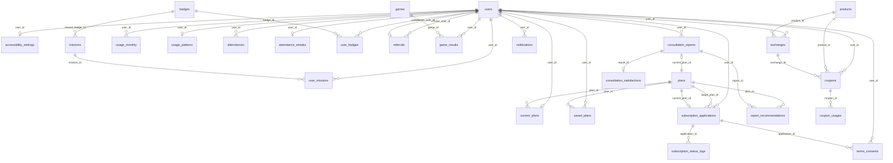

# AI 통신 요금제 상담 챗봇 — 데이터 모델링 문서

| 항목      | 내용                                                    |
| --------- | ------------------------------------------------------- |
| 문서명    | 데이터 모델링 명세서 (v2)                               |
| 버전      | v2.0                                                    |
| 기준 문서 | `supabase/migrations/20260820000001_initial_schema.sql` |
| 대상 DBMS | PostgreSQL 17 / Supabase                                |
| 인증      | Supabase Auth + Kakao OAuth                             |
| 작성일    | 2026-08-20                                              |

## v2 스키마 변경 요약

v1에서 설계했던 `consultations` 및 `consultation_messages` 테이블이 제거되었습니다. AI 상담은 최종 산출물인 `consultation_reports` 하나만 영구 저장하며, 추천 요금제(`report_recommendations`)와 만족도(`consultation_satisfactions`)를 레포트 하위에서 관리합니다. 요금제 카탈로그(`plans`)는 `plans.json`의 정수 `id`와 호환됩니다.

## ERD

## 테이블 정의

### 1. users

| 컬럼명     | 타입        | NULL | 기본값  | 설명                                                    |
| ---------- | ----------- | ---- | ------- | ------------------------------------------------------- |
| id         | UUID        | NO   | -       | Supabase Auth `auth.users(id)`와 1:1 매핑되는 사용자 PK |
| kakao_id   | TEXT        | NO   | -       | 카카오 고유 ID                                          |
| email      | TEXT        | YES  | -       | 이메일                                                  |
| phone      | TEXT        | YES  | -       | 전화번호                                                |
| nickname   | TEXT        | YES  | -       | 닉네임                                                  |
| age_group  | TEXT        | YES  | -       | 연령대                                                  |
| is_active  | BOOLEAN     | NO   | `true`  | 활성 여부                                               |
| deleted_at | TIMESTAMPTZ | YES  | -       | 탈퇴/삭제 시각                                          |
| created_at | TIMESTAMPTZ | NO   | `now()` | 생성 시각                                               |
| updated_at | TIMESTAMPTZ | NO   | `now()` | 수정 시각                                               |

- **PK**: `id`
- **UNIQUE**: `kakao_id`
- **FK**: `id` → `auth.users(id)` ON DELETE CASCADE
- **INDEX**: (PK/UNIQUE 외 추가 인덱스 없음)
- **RLS**: `users_select_self` (SELECT, `id = auth.uid()`), `users_update_self` (UPDATE, `id = auth.uid()`)
- **Trigger**: `trg_users_updated`

### 2. accessibility_settings

| 컬럼명     | 타입        | NULL | 기본값  | 설명              |
| ---------- | ----------- | ---- | ------- | ----------------- |
| user_id    | UUID        | NO   | -       | 사용자 PK/FK      |
| easy_mode  | BOOLEAN     | NO   | `false` | 쉬운 모드 여부    |
| large_font | BOOLEAN     | NO   | `false` | 큰 글씨 모드 여부 |
| created_at | TIMESTAMPTZ | NO   | `now()` | 생성 시각         |
| updated_at | TIMESTAMPTZ | NO   | `now()` | 수정 시각         |

- **PK**: `user_id`
- **UNIQUE**: (PK 외 없음)
- **FK**: `user_id` → `users(id)` ON DELETE CASCADE
- **INDEX**: `idx_accessibility_settings_user_id`
- **RLS**: `accessibility_settings_owner` (ALL, `user_id = auth.uid()`)
- **Trigger**: `trg_accessibility_settings_updated`

### 3. plans

| 컬럼명                 | 타입          | NULL | 기본값                             | 설명                                  |
| ---------------------- | ------------- | ---- | ---------------------------------- | ------------------------------------- |
| id                     | BIGINT        | NO   | `GENERATED BY DEFAULT AS IDENTITY` | 요금제 PK (`plans.json` 정수 id 호환) |
| name                   | TEXT          | NO   | -                                  | 요금제명                              |
| carrier                | TEXT          | NO   | `'LG U+'`                          | 통신사                                |
| category               | TEXT          | NO   | -                                  | 카테고리                              |
| target_age             | TEXT          | NO   | -                                  | 대상 연령대                           |
| data_tier              | TEXT          | NO   | -                                  | 데이터 등급                           |
| monthly_fee            | INT           | NO   | -                                  | 월정액(원)                            |
| data                   | TEXT          | NO   | -                                  | 데이터 제공량 문구                    |
| data_amount_gb         | NUMERIC(10,2) | NO   | -                                  | 데이터 용량(GB)                       |
| data_speed_after       | TEXT          | YES  | -                                  | 데이터 소진 후 속도                   |
| voice                  | TEXT          | NO   | -                                  | 통화 제공 문구                        |
| call_amount_min        | INT           | NO   | -                                  | 통화 분(min)                          |
| message                | TEXT          | NO   | -                                  | 문자 제공 문구                        |
| sms_amount             | INT           | NO   | -                                  | 문자 건수                             |
| share_data             | TEXT          | YES  | -                                  | 공유(셰어) 데이터                     |
| tethering              | TEXT          | YES  | -                                  | 테더링 조건                           |
| notes                  | TEXT          | YES  | -                                  | 비고                                  |
| benefits               | JSONB         | NO   | `'[]'::jsonb`                      | 부가 혜택 목록                        |
| ott_benefits           | JSONB         | NO   | `'[]'::jsonb`                      | OTT 혜택 목록                         |
| add_ons                | JSONB         | NO   | `'[]'::jsonb`                      | 부가 서비스 목록                      |
| contract_period_months | INT           | YES  | -                                  | 약정 기간(월)                         |
| is_active              | BOOLEAN       | NO   | `true`                             | 판매 중 여부                          |
| sort_order             | INT           | NO   | `0`                                | 정렬 순서                             |
| created_at             | TIMESTAMPTZ   | NO   | `now()`                            | 생성 시각                             |
| updated_at             | TIMESTAMPTZ   | NO   | `now()`                            | 수정 시각                             |

- **PK**: `id`
- **UNIQUE**: (PK 외 없음)
- **FK**: (없음)
- **INDEX**: `idx_plans_carrier`, `idx_plans_category`, `idx_plans_target_age`, `idx_plans_data_tier`, `idx_plans_monthly_fee`, `idx_plans_is_active`, `idx_plans_sort_order`, `idx_plans_carrier_target_age_active`, `idx_plans_benefits_gin`, `idx_plans_ott_benefits_gin`, `idx_plans_add_ons_gin`
- **RLS**: `plans_select_active` (SELECT, `is_active = true`)
- **Trigger**: `trg_plans_updated`

### 4. saved_plans

| 컬럼명     | 타입        | NULL | 기본값              | 설명      |
| ---------- | ----------- | ---- | ------------------- | --------- |
| id         | UUID        | NO   | `gen_random_uuid()` | 저장 PK   |
| user_id    | UUID        | NO   | -                   | 사용자 FK |
| plan_id    | BIGINT      | NO   | -                   | 요금제 FK |
| created_at | TIMESTAMPTZ | NO   | `now()`             | 생성 시각 |

- **PK**: `id`
- **UNIQUE**: `(user_id, plan_id)` (`uq_saved_plans_user_plan`)
- **FK**: `user_id` → `users(id)` ON DELETE CASCADE, `plan_id` → `plans(id)` ON DELETE CASCADE
- **INDEX**: `idx_saved_plans_user_id`, `idx_saved_plans_plan_id`
- **RLS**: `saved_plans_owner` (ALL, `user_id = auth.uid()`)
- **Trigger**: (없음)

### 5. current_plans

| 컬럼명     | 타입        | NULL | 기본값  | 설명           |
| ---------- | ----------- | ---- | ------- | -------------- |
| user_id    | UUID        | NO   | -       | 사용자 PK/FK   |
| plan_id    | BIGINT      | NO   | -       | 현재 요금제 FK |
| started_at | DATE        | NO   | `now()` | 가입 시작일    |
| updated_at | TIMESTAMPTZ | NO   | `now()` | 수정 시각      |

- **PK**: `user_id`
- **UNIQUE**: (PK 외 없음)
- **FK**: `user_id` → `users(id)` ON DELETE CASCADE, `plan_id` → `plans(id)`
- **INDEX**: `idx_current_plans_plan_id`
- **RLS**: `current_plans_owner` (ALL, `user_id = auth.uid()`)
- **Trigger**: `trg_current_plans_updated`

### 6. consultation_reports

| 컬럼명          | 타입        | NULL | 기본값              | 설명                 |
| --------------- | ----------- | ---- | ------------------- | -------------------- |
| id              | UUID        | NO   | `gen_random_uuid()` | 상담 레포트 PK       |
| user_id         | UUID        | NO   | -                   | 사용자 FK            |
| summary_title   | TEXT        | YES  | -                   | 요약 제목            |
| summary         | TEXT        | NO   | -                   | 상담 요약 내용       |
| analysis_input  | JSONB       | YES  | `'{}'::jsonb`       | 분석 입력 데이터     |
| current_plan_id | BIGINT      | YES  | -                   | 현재 요금제 FK(선택) |
| total_savings   | INT         | NO   | `0`                 | 총 절감액(원)        |
| created_at      | TIMESTAMPTZ | NO   | `now()`             | 생성 시각            |
| updated_at      | TIMESTAMPTZ | NO   | `now()`             | 수정 시각            |

- **PK**: `id`
- **UNIQUE**: (없음)
- **FK**: `user_id` → `users(id)` ON DELETE CASCADE, `current_plan_id` → `plans(id)`
- **INDEX**: `idx_consultation_reports_user_id`, `idx_consultation_reports_user_created`, `idx_consultation_reports_current_plan_id`
- **RLS**: `consultation_reports_owner` (ALL, `user_id = auth.uid()`)
- **Trigger**: `trg_consultation_reports_updated`

### 7. report_recommendations

| 컬럼명     | 타입        | NULL | 기본값              | 설명            |
| ---------- | ----------- | ---- | ------------------- | --------------- |
| id         | UUID        | NO   | `gen_random_uuid()` | 추천 PK         |
| report_id  | UUID        | NO   | -                   | 상담 레포트 FK  |
| plan_id    | BIGINT      | NO   | -                   | 추천 요금제 FK  |
| reason     | TEXT        | YES  | -                   | 추천 사유       |
| savings    | INT         | NO   | `0`                 | 예상 절감액(원) |
| sort_order | INT         | NO   | `0`                 | 정렬 순서       |
| created_at | TIMESTAMPTZ | NO   | `now()`             | 생성 시각       |

- **PK**: `id`
- **UNIQUE**: (없음)
- **FK**: `report_id` → `consultation_reports(id)` ON DELETE CASCADE, `plan_id` → `plans(id)`
- **INDEX**: `idx_report_recommendations_report_id`, `idx_report_recommendations_plan_id`, `idx_report_recommendations_report_sort`
- **RLS**: `report_recommendations_via_report` (SELECT, `consultation_reports` 소유자 확인)
- **Trigger**: (없음)

### 8. consultation_satisfactions

| 컬럼명     | 타입        | NULL | 기본값              | 설명           |
| ---------- | ----------- | ---- | ------------------- | -------------- |
| id         | UUID        | NO   | `gen_random_uuid()` | 만족도 PK      |
| report_id  | UUID        | NO   | -                   | 레포트 FK(1:1) |
| rating     | TEXT        | NO   | -                   | 만족도 평가    |
| feedback   | TEXT        | YES  | -                   | 추가 피드백    |
| created_at | TIMESTAMPTZ | NO   | `now()`             | 생성 시각      |

- **PK**: `id`
- **UNIQUE**: `report_id`
- **FK**: `report_id` → `consultation_reports(id)` ON DELETE CASCADE
- **INDEX**: `idx_consultation_satisfactions_report_id`
- **RLS**: `consultation_satisfactions_via_report` (ALL, `consultation_reports` 소유자 확인)
- **Trigger**: (없음)

### 9. usage_monthly

| 컬럼명         | 타입          | NULL | 기본값              | 설명              |
| -------------- | ------------- | ---- | ------------------- | ----------------- |
| id             | UUID          | NO   | `gen_random_uuid()` | 사용량 PK         |
| user_id        | UUID          | NO   | -                   | 사용자 FK         |
| year_month     | TEXT          | NO   | -                   | 연월(예: 2026-08) |
| data_used_gb   | NUMERIC(10,2) | NO   | `0`                 | 데이터 사용량(GB) |
| call_used_min  | INT           | NO   | `0`                 | 통화 사용량(분)   |
| sms_used_count | INT           | NO   | `0`                 | 문자 사용량(건)   |
| created_at     | TIMESTAMPTZ   | NO   | `now()`             | 생성 시각         |
| updated_at     | TIMESTAMPTZ   | NO   | `now()`             | 수정 시각         |

- **PK**: `id`
- **UNIQUE**: `(user_id, year_month)` (`uq_usage_monthly_user_month`)
- **FK**: `user_id` → `users(id)` ON DELETE CASCADE
- **INDEX**: `idx_usage_monthly_user_id`
- **RLS**: `usage_monthly_owner` (ALL, `user_id = auth.uid()`)
- **Trigger**: `trg_usage_monthly_updated`

### 10. usage_patterns

| 컬럼명          | 타입          | NULL | 기본값  | 설명             |
| --------------- | ------------- | ---- | ------- | ---------------- |
| user_id         | UUID          | NO   | -       | 사용자 PK/FK     |
| avg_data_gb     | NUMERIC(10,2) | NO   | `0`     | 평균 데이터(GB)  |
| avg_call_min    | INT           | NO   | `0`     | 평균 통화(분)    |
| avg_sms_count   | INT           | NO   | `0`     | 평균 문자(건)    |
| over_usage_data | BOOLEAN       | NO   | `false` | 데이터 초과 여부 |
| trend_6m        | JSONB         | YES  | -       | 6개월 추세       |
| trend_12m       | JSONB         | YES  | -       | 12개월 추세      |
| calculated_at   | TIMESTAMPTZ   | NO   | `now()` | 계산 시각        |
| created_at      | TIMESTAMPTZ   | NO   | `now()` | 생성 시각        |
| updated_at      | TIMESTAMPTZ   | NO   | `now()` | 수정 시각        |

- **PK**: `user_id`
- **UNIQUE**: (PK 외 없음)
- **FK**: `user_id` → `users(id)` ON DELETE CASCADE
- **INDEX**: (없음)
- **RLS**: `usage_patterns_owner` (ALL, `user_id = auth.uid()`)
- **Trigger**: `trg_usage_patterns_updated`

### 11. attendances

| 컬럼명       | 타입        | NULL | 기본값              | 설명      |
| ------------ | ----------- | ---- | ------------------- | --------- |
| id           | UUID        | NO   | `gen_random_uuid()` | 출석 PK   |
| user_id      | UUID        | NO   | -                   | 사용자 FK |
| date         | DATE        | NO   | -                   | 출석일    |
| reward_type  | TEXT        | YES  | -                   | 보상 유형 |
| reward_value | INT         | NO   | `0`                 | 보상 값   |
| created_at   | TIMESTAMPTZ | NO   | `now()`             | 생성 시각 |

- **PK**: `id`
- **UNIQUE**: `(user_id, date)` (`uq_attendances_user_date`)
- **FK**: `user_id` → `users(id)` ON DELETE CASCADE
- **INDEX**: `idx_attendances_user_id`
- **RLS**: `attendances_owner` (ALL, `user_id = auth.uid()`)
- **Trigger**: (없음)

### 12. attendance_streaks

| 컬럼명           | 타입        | NULL | 기본값  | 설명             |
| ---------------- | ----------- | ---- | ------- | ---------------- |
| user_id          | UUID        | NO   | -       | 사용자 PK/FK     |
| current_streak   | INT         | NO   | `0`     | 현재 연속 출석일 |
| longest_streak   | INT         | NO   | `0`     | 최장 연속 출석일 |
| last_attended_at | DATE        | YES  | -       | 마지막 출석일    |
| updated_at       | TIMESTAMPTZ | NO   | `now()` | 수정 시각        |

- **PK**: `user_id`
- **UNIQUE**: (PK 외 없음)
- **FK**: `user_id` → `users(id)` ON DELETE CASCADE
- **INDEX**: (없음)
- **RLS**: `attendance_streaks_owner` (ALL, `user_id = auth.uid()`)
- **Trigger**: `trg_attendance_streaks_updated`

### 13. badges

| 컬럼명      | 타입        | NULL | 기본값              | 설명       |
| ----------- | ----------- | ---- | ------------------- | ---------- |
| id          | UUID        | NO   | `gen_random_uuid()` | 배지 PK    |
| name        | TEXT        | NO   | -                   | 배지명     |
| description | TEXT        | YES  | -                   | 설명       |
| image_url   | TEXT        | YES  | -                   | 이미지 URL |
| type        | TEXT        | NO   | -                   | 배지 유형  |
| created_at  | TIMESTAMPTZ | NO   | `now()`             | 생성 시각  |

- **PK**: `id`
- **UNIQUE**: (없음)
- **FK**: (없음)
- **INDEX**: (없음)
- **RLS**: `badges_select` (SELECT, `true`)
- **Trigger**: (없음)

### 14. user_badges

| 컬럼명       | 타입        | NULL | 기본값              | 설명           |
| ------------ | ----------- | ---- | ------------------- | -------------- |
| id           | UUID        | NO   | `gen_random_uuid()` | 사용자 배지 PK |
| user_id      | UUID        | NO   | -                   | 사용자 FK      |
| badge_id     | UUID        | NO   | -                   | 배지 FK        |
| balance      | INT         | NO   | `0`                 | 보유 수량      |
| total_earned | INT         | NO   | `0`                 | 누적 획득 수량 |
| created_at   | TIMESTAMPTZ | NO   | `now()`             | 생성 시각      |
| updated_at   | TIMESTAMPTZ | NO   | `now()`             | 수정 시각      |

- **PK**: `id`
- **UNIQUE**: `(user_id, badge_id)` (`uq_user_badges_user_badge`)
- **FK**: `user_id` → `users(id)` ON DELETE CASCADE, `badge_id` → `badges(id)` ON DELETE CASCADE
- **INDEX**: `idx_user_badges_user_id`, `idx_user_badges_badge_id`
- **RLS**: `user_badges_owner` (ALL, `user_id = auth.uid()`)
- **Trigger**: `trg_user_badges_updated`

### 15. missions

| 컬럼명          | 타입        | NULL | 기본값              | 설명         |
| --------------- | ----------- | ---- | ------------------- | ------------ |
| id              | UUID        | NO   | `gen_random_uuid()` | 미션 PK      |
| name            | TEXT        | NO   | -                   | 미션명       |
| description     | TEXT        | YES  | -                   | 설명         |
| condition_type  | TEXT        | NO   | -                   | 조건 유형    |
| condition_value | INT         | NO   | `0`                 | 조건 값      |
| reward_badge_id | UUID        | NO   | -                   | 보상 배지 FK |
| reward_amount   | INT         | NO   | `0`                 | 보상 수량    |
| is_active       | BOOLEAN     | NO   | `true`              | 활성 여부    |
| created_at      | TIMESTAMPTZ | NO   | `now()`             | 생성 시각    |
| updated_at      | TIMESTAMPTZ | NO   | `now()`             | 수정 시각    |

- **PK**: `id`
- **UNIQUE**: (PK 외 없음)
- **FK**: `reward_badge_id` → `badges(id)`
- **INDEX**: `idx_missions_reward_badge_id`, `idx_missions_is_active`
- **RLS**: `missions_select_active` (SELECT, `is_active = true`)
- **Trigger**: `trg_missions_updated`

### 16. user_missions

| 컬럼명       | 타입        | NULL | 기본값              | 설명           |
| ------------ | ----------- | ---- | ------------------- | -------------- |
| id           | UUID        | NO   | `gen_random_uuid()` | 사용자 미션 PK |
| user_id      | UUID        | NO   | -                   | 사용자 FK      |
| mission_id   | UUID        | NO   | -                   | 미션 FK        |
| status       | TEXT        | NO   | `'in_progress'`     | 진행 상태      |
| completed_at | TIMESTAMPTZ | YES  | -                   | 완료 시각      |
| created_at   | TIMESTAMPTZ | NO   | `now()`             | 생성 시각      |
| updated_at   | TIMESTAMPTZ | NO   | `now()`             | 수정 시각      |

- **PK**: `id`
- **UNIQUE**: `(user_id, mission_id)` (`uq_user_missions_user_mission`)
- **FK**: `user_id` → `users(id)` ON DELETE CASCADE, `mission_id` → `missions(id)` ON DELETE CASCADE
- **INDEX**: `idx_user_missions_user_id`, `idx_user_missions_mission_id`
- **RLS**: `user_missions_owner` (ALL, `user_id = auth.uid()`)
- **Trigger**: `trg_user_missions_updated`

### 17. referrals

| 컬럼명           | 타입        | NULL | 기본값              | 설명              |
| ---------------- | ----------- | ---- | ------------------- | ----------------- |
| id               | UUID        | NO   | `gen_random_uuid()` | 추천 PK           |
| referrer_user_id | UUID        | NO   | -                   | 추천인 FK         |
| referred_user_id | UUID        | YES  | -                   | 피추천인 FK(선택) |
| referral_code    | TEXT        | NO   | -                   | 추천 코드         |
| status           | TEXT        | NO   | `'pending'`         | 상태              |
| reward_given_at  | TIMESTAMPTZ | YES  | -                   | 보상 지급 시각    |
| created_at       | TIMESTAMPTZ | NO   | `now()`             | 생성 시각         |

- **PK**: `id`
- **UNIQUE**: `referred_user_id` (`uq_referrals_referred_user`), `referral_code` (`uq_referrals_code`)
- **FK**: `referrer_user_id` → `users(id)` ON DELETE CASCADE, `referred_user_id` → `users(id)` ON DELETE SET NULL
- **INDEX**: `idx_referrals_referrer_user_id`
- **RLS**: `referrals_owner` (ALL, `referrer_user_id = auth.uid() OR referred_user_id = auth.uid()`)
- **Trigger**: (없음)

### 18. games

| 컬럼명     | 타입        | NULL | 기본값              | 설명      |
| ---------- | ----------- | ---- | ------------------- | --------- |
| id         | UUID        | NO   | `gen_random_uuid()` | 게임 PK   |
| type       | TEXT        | NO   | -                   | 게임 유형 |
| name       | TEXT        | NO   | -                   | 게임명    |
| created_at | TIMESTAMPTZ | NO   | `now()`             | 생성 시각 |

- **PK**: `id`
- **UNIQUE**: (없음)
- **FK**: (없음)
- **INDEX**: (없음)
- **RLS**: `games_select` (SELECT, `true`)
- **Trigger**: (없음)

### 19. game_results

| 컬럼명     | 타입        | NULL | 기본값              | 설명         |
| ---------- | ----------- | ---- | ------------------- | ------------ |
| id         | UUID        | NO   | `gen_random_uuid()` | 게임 결과 PK |
| user_id    | UUID        | NO   | -                   | 사용자 FK    |
| game_id    | UUID        | NO   | -                   | 게임 FK      |
| score      | INT         | NO   | `0`                 | 점수         |
| played_at  | TIMESTAMPTZ | NO   | `now()`             | 플레이 시각  |
| created_at | TIMESTAMPTZ | NO   | `now()`             | 생성 시각    |

- **PK**: `id`
- **UNIQUE**: (없음)
- **FK**: `user_id` → `users(id)` ON DELETE CASCADE, `game_id` → `games(id)` ON DELETE CASCADE
- **INDEX**: `idx_game_results_user_id`, `idx_game_results_game_id`
- **RLS**: `game_results_owner` (ALL, `user_id = auth.uid()`)
- **Trigger**: (없음)

### 20. products

| 컬럼명          | 타입        | NULL | 기본값              | 설명         |
| --------------- | ----------- | ---- | ------------------- | ------------ |
| id              | UUID        | NO   | `gen_random_uuid()` | 상품 PK      |
| name            | TEXT        | NO   | -                   | 상품명       |
| description     | TEXT        | YES  | -                   | 설명         |
| required_badges | INT         | NO   | `0`                 | 필요 배지 수 |
| stock           | INT         | YES  | -                   | 재고         |
| is_active       | BOOLEAN     | NO   | `true`              | 활성 여부    |
| created_at      | TIMESTAMPTZ | NO   | `now()`             | 생성 시각    |
| updated_at      | TIMESTAMPTZ | NO   | `now()`             | 수정 시각    |

- **PK**: `id`
- **UNIQUE**: (없음)
- **FK**: (없음)
- **INDEX**: `idx_products_is_active`
- **RLS**: `products_select_active` (SELECT, `is_active = true`)
- **Trigger**: `trg_products_updated`

### 21. exchanges

| 컬럼명      | 타입        | NULL | 기본값              | 설명         |
| ----------- | ----------- | ---- | ------------------- | ------------ |
| id          | UUID        | NO   | `gen_random_uuid()` | 교환 PK      |
| user_id     | UUID        | NO   | -                   | 사용자 FK    |
| product_id  | UUID        | NO   | -                   | 상품 FK      |
| used_badges | INT         | NO   | `0`                 | 사용 배지 수 |
| created_at  | TIMESTAMPTZ | NO   | `now()`             | 생성 시각    |

- **PK**: `id`
- **UNIQUE**: (없음)
- **FK**: `user_id` → `users(id)` ON DELETE CASCADE, `product_id` → `products(id)`
- **INDEX**: `idx_exchanges_user_id`, `idx_exchanges_product_id`
- **RLS**: `exchanges_owner` (ALL, `user_id = auth.uid()`)
- **Trigger**: (없음)

### 22. coupons

| 컬럼명         | 타입        | NULL | 기본값              | 설명          |
| -------------- | ----------- | ---- | ------------------- | ------------- |
| id             | UUID        | NO   | `gen_random_uuid()` | 쿠폰 PK       |
| exchange_id    | UUID        | YES  | -                   | 교환 FK(선택) |
| user_id        | UUID        | NO   | -                   | 사용자 FK     |
| product_id     | UUID        | NO   | -                   | 상품 FK       |
| barcode        | TEXT        | NO   | -                   | 바코드        |
| encrypted_code | TEXT        | NO   | -                   | 암호화된 코드 |
| status         | TEXT        | NO   | `'unused'`          | 상태          |
| used_at        | TIMESTAMPTZ | YES  | -                   | 사용 시각     |
| expired_at     | DATE        | YES  | -                   | 만료일        |
| created_at     | TIMESTAMPTZ | NO   | `now()`             | 생성 시각     |
| updated_at     | TIMESTAMPTZ | NO   | `now()`             | 수정 시각     |

- **PK**: `id`
- **UNIQUE**: `barcode` (`uq_coupons_barcode`)
- **FK**: `exchange_id` → `exchanges(id)`, `user_id` → `users(id)` ON DELETE CASCADE, `product_id` → `products(id)`
- **INDEX**: `idx_coupons_user_id`, `idx_coupons_product_id`, `idx_coupons_exchange_id`, `idx_coupons_status`, `idx_coupons_expired_at`
- **RLS**: `coupons_owner` (ALL, `user_id = auth.uid()`)
- **Trigger**: `trg_coupons_updated`

### 23. coupon_usages

| 컬럼명     | 타입        | NULL | 기본값              | 설명              |
| ---------- | ----------- | ---- | ------------------- | ----------------- |
| id         | UUID        | NO   | `gen_random_uuid()` | 쿠폰 사용 이력 PK |
| coupon_id  | UUID        | NO   | -                   | 쿠폰 FK           |
| store_name | TEXT        | YES  | -                   | 사용처            |
| used_at    | TIMESTAMPTZ | NO   | `now()`             | 사용 시각         |
| created_at | TIMESTAMPTZ | NO   | `now()`             | 생성 시각         |

- **PK**: `id`
- **UNIQUE**: (없음)
- **FK**: `coupon_id` → `coupons(id)` ON DELETE CASCADE
- **INDEX**: `idx_coupon_usages_coupon_id`
- **RLS**: `coupon_usages_via_coupon` (ALL, `coupons` 소유자 확인)
- **Trigger**: (없음)

### 24. subscription_applications

| 컬럼명            | 타입        | NULL | 기본값              | 설명                 |
| ----------------- | ----------- | ---- | ------------------- | -------------------- |
| id                | UUID        | NO   | `gen_random_uuid()` | 가입 신청 PK         |
| user_id           | UUID        | NO   | -                   | 사용자 FK            |
| target_plan_id    | BIGINT      | NO   | -                   | 신청 대상 요금제 FK  |
| current_plan_id   | BIGINT      | YES  | -                   | 현재 요금제 FK(선택) |
| status            | TEXT        | NO   | `'submitted'`       | 신청 상태            |
| identity_verified | BOOLEAN     | NO   | `false`             | 본인 인증 여부       |
| terms_agreed_at   | TIMESTAMPTZ | YES  | -                   | 약관 동의 시각       |
| requested_at      | TIMESTAMPTZ | NO   | `now()`             | 신청 시각            |
| completed_at      | TIMESTAMPTZ | YES  | -                   | 완료 시각            |
| canceled_at       | TIMESTAMPTZ | YES  | -                   | 취소 시각            |
| cancel_reason     | TEXT        | YES  | -                   | 취소 사유            |
| created_at        | TIMESTAMPTZ | NO   | `now()`             | 생성 시각            |
| updated_at        | TIMESTAMPTZ | NO   | `now()`             | 수정 시각            |

- **PK**: `id`
- **UNIQUE**: (없음)
- **FK**: `user_id` → `users(id)` ON DELETE CASCADE, `target_plan_id` → `plans(id)`, `current_plan_id` → `plans(id)`
- **INDEX**: `idx_subscription_applications_user_id`, `idx_subscription_applications_target_plan_id`, `idx_subscription_applications_current_plan_id`, `idx_subscription_applications_user_requested`
- **RLS**: `subscription_applications_owner` (ALL, `user_id = auth.uid()`)
- **Trigger**: `trg_subscription_applications_updated`

### 25. subscription_status_logs

| 컬럼명         | 타입        | NULL | 기본값              | 설명         |
| -------------- | ----------- | ---- | ------------------- | ------------ |
| id             | UUID        | NO   | `gen_random_uuid()` | 상태 이력 PK |
| application_id | UUID        | NO   | -                   | 가입 신청 FK |
| status         | TEXT        | NO   | -                   | 상태         |
| changed_at     | TIMESTAMPTZ | NO   | `now()`             | 변경 시각    |
| note           | TEXT        | YES  | -                   | 비고         |
| created_at     | TIMESTAMPTZ | NO   | `now()`             | 생성 시각    |

- **PK**: `id`
- **UNIQUE**: (없음)
- **FK**: `application_id` → `subscription_applications(id)` ON DELETE CASCADE
- **INDEX**: `idx_subscription_status_logs_application_id`
- **RLS**: `subscription_status_logs_via_application` (SELECT, `subscription_applications` 소유자 확인)
- **Trigger**: (없음)

### 26. terms_consents

| 컬럼명         | 타입        | NULL | 기본값              | 설명               |
| -------------- | ----------- | ---- | ------------------- | ------------------ |
| id             | UUID        | NO   | `gen_random_uuid()` | 약관 동의 PK       |
| user_id        | UUID        | NO   | -                   | 사용자 FK          |
| application_id | UUID        | YES  | -                   | 가입 신청 FK(선택) |
| term_type      | TEXT        | NO   | -                   | 약관 유형          |
| version        | TEXT        | NO   | -                   | 약관 버전          |
| agreed_at      | TIMESTAMPTZ | NO   | `now()`             | 동의 시각          |
| ip             | TEXT        | YES  | -                   | 동의 IP            |
| created_at     | TIMESTAMPTZ | NO   | `now()`             | 생성 시각          |

- **PK**: `id`
- **UNIQUE**: (없음)
- **FK**: `user_id` → `users(id)` ON DELETE CASCADE, `application_id` → `subscription_applications(id)` ON DELETE CASCADE
- **INDEX**: `idx_terms_consents_user_id`, `idx_terms_consents_application_id`
- **RLS**: `terms_consents_via_application` (ALL, `user_id = auth.uid()` 또는 `subscription_applications` 소유자 확인)
- **Trigger**: (없음)

### 27. notifications

| 컬럼명     | 타입        | NULL | 기본값              | 설명      |
| ---------- | ----------- | ---- | ------------------- | --------- |
| id         | UUID        | NO   | `gen_random_uuid()` | 알림 PK   |
| user_id    | UUID        | NO   | -                   | 사용자 FK |
| type       | TEXT        | NO   | -                   | 알림 유형 |
| title      | TEXT        | NO   | -                   | 제목      |
| body       | TEXT        | YES  | -                   | 본문      |
| sent_at    | TIMESTAMPTZ | YES  | -                   | 발송 시각 |
| read_at    | TIMESTAMPTZ | YES  | -                   | 읽음 시각 |
| created_at | TIMESTAMPTZ | NO   | `now()`             | 생성 시각 |

- **PK**: `id`
- **UNIQUE**: (없음)
- **FK**: `user_id` → `users(id)` ON DELETE CASCADE
- **INDEX**: `idx_notifications_user_id`, `idx_notifications_user_sent`
- **RLS**: `notifications_owner` (ALL, `user_id = auth.uid()`)
- **Trigger**: (없음)

## 공통 컨벤션

- **`created_at` / `updated_at`**: 거의 모든 테이블에 생성 시각과 수정 시각을 TIMESTAMPTZ로 두며, 기본값은 `now()`입니다.
- **`set_updated_at()` 트리거**: `public.set_updated_at()` 함수를 통해 `BEFORE UPDATE` 트리거가 등록된 테이블은 `updated_at` 컬럼을 자동으로 갱신합니다.
- **RLS `auth.uid()` 기반 소유 정책**: 사용자 데이터 테이블은 `ENABLE ROW LEVEL SECURITY`가 활성화되어 있으며, 대부분 `auth.uid()`와 `user_id`를 비교하는 소유자 정책으로 접근을 제어합니다.
- **`pgcrypto` 확장**: 스키마 최상단에서 `CREATE EXTENSION IF NOT EXISTS "pgcrypto"`로 활성화하며, `gen_random_uuid()`를 사용한 UUID 기본값에 필요합니다.
